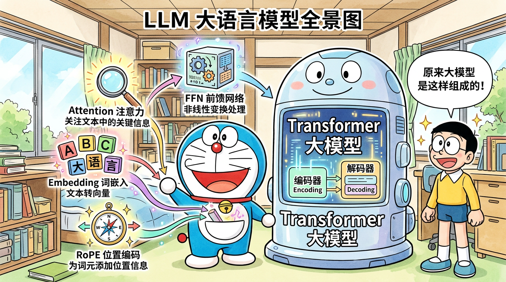
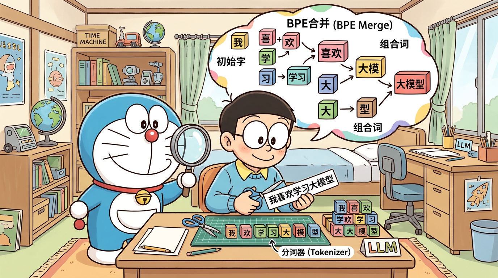
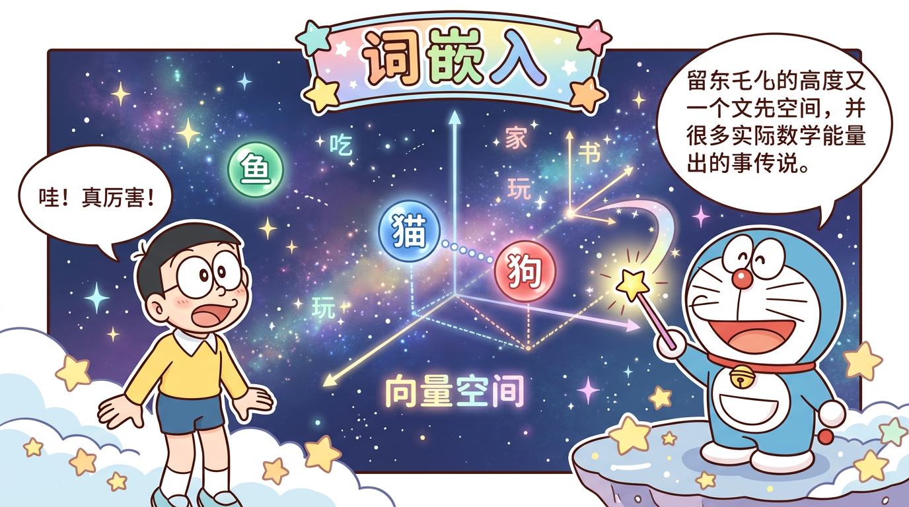
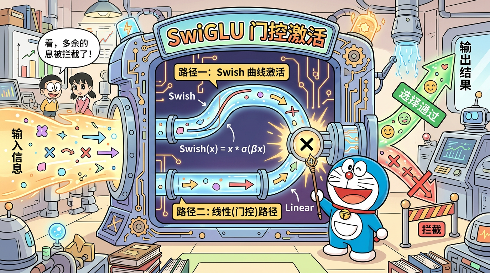
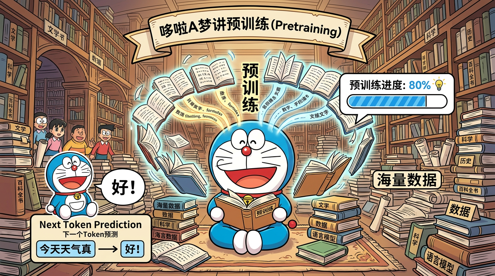
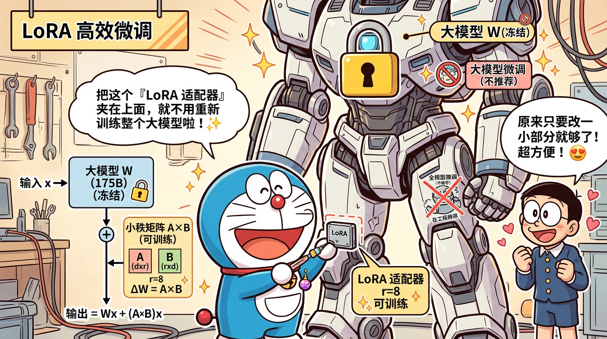
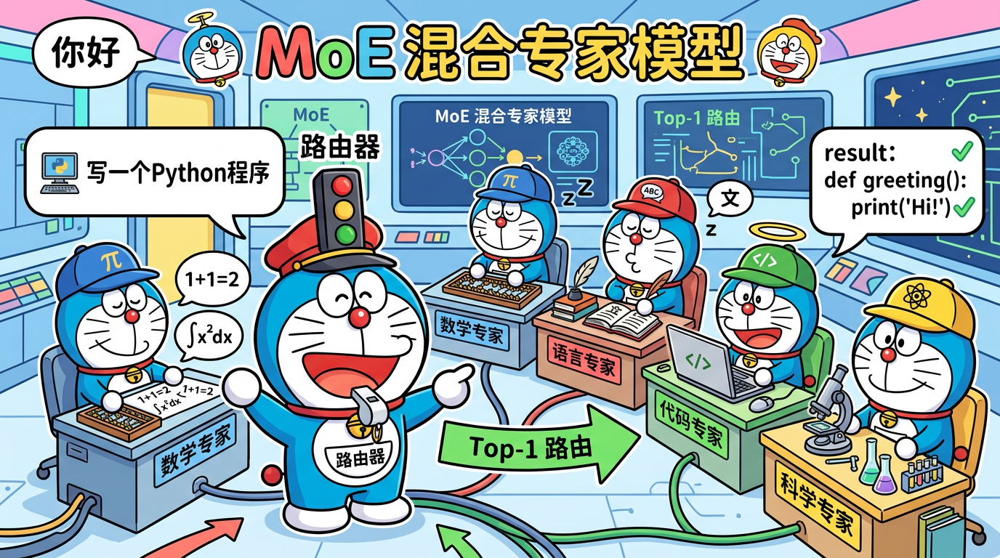
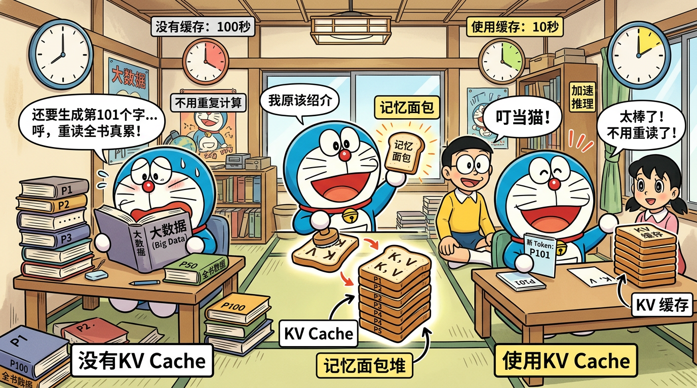
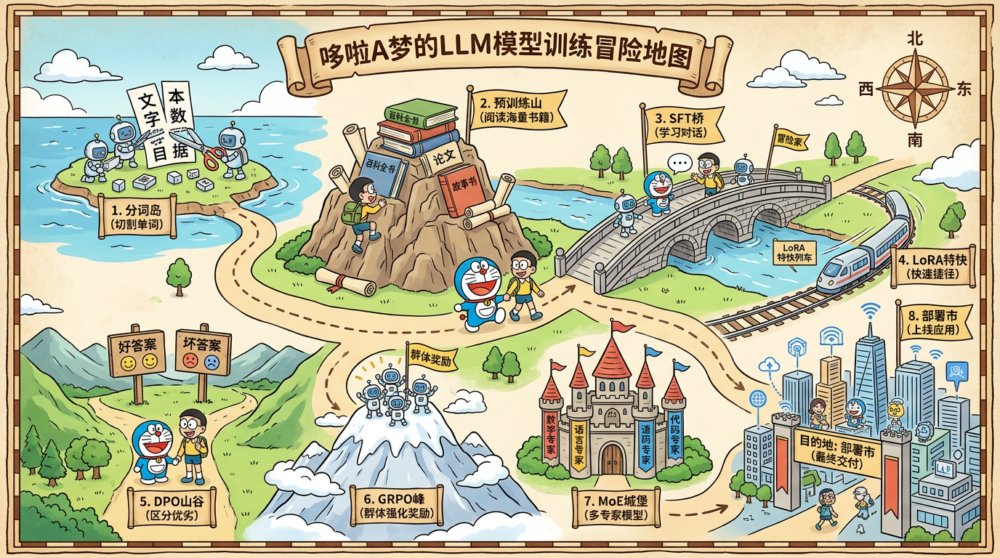

<p align="center">
  <h1 align="center">Learn MiniMind</h1>
  <p align="center">
    <em>从零基础到面试通关 —— 24节课 + 190道面试题 + 哆啦A梦图解，彻底搞懂大语言模型</em>
  </p>
</p>

<p align="center">
  <a href="#-快速开始">快速开始</a> •
  <a href="#-课程目录">课程目录</a> •
  <a href="#-面试宝典">面试宝典</a> •
  <a href="#-学习路线图">学习路线图</a> •
  <a href="#-哆啦a梦图解">漫画图解</a> •
  <a href="#-多格式输出">多格式输出</a>
</p>

---

## 这个项目是什么？

> **用 24 节课 + 190 道面试八股文 + 15 张哆啦A梦漫画图解，把一个完全零基础的小白，带到能在面试中自信讲述"我从零训练了一个大语言模型"的水平。**

[MiniMind](https://github.com/jingyaogong/minimind) 是一个仅需 3 块钱、2 小时就能从零训练出 64M 参数 GPT 的开源项目，在 GitHub 上获得了 45k+ Star。本仓库是 MiniMind 的**系统化学习教程 + 面试备战手册**，专为以下人群设计：

- **零基础小白** —— 不懂 Python、不懂深度学习也能看懂，配有哆啦A梦漫画图解
- **求职面试者** —— 190+ 道面试八股文 + STAR 面试稿 + 简历撰写指南
- **想动手实践** —— 每节课都有可运行的 PyTorch 实验代码

### 本项目的特色

| 特色 | 说明 |
|------|------|
| **190+ 面试题** | 覆盖 Transformer 深度拷问、训练全流程、推理优化、工程实践、MiniMind 专属追问 |
| **STAR 面试稿** | 30秒/1分钟/3分钟自我介绍 + 7 个技术难点 STAR 应对 + 12 轮模拟面试 |
| **简历撰写指南** | 4 种详略版本 + 4 个岗位方向调整 + 6 组普通/优化写法对比 |
| **哆啦A梦漫画** | 15 张原创漫画，用生动形象的方式解释核心概念 |
| **源码深度解析** | 7 门核心课程增加源码逐行解读 + 动手实验 + 面试考点 |
| **多格式输出** | Markdown / HTML / PDF 三种格式，随时随地学习 |

---

## 学习路线图

```
你现在在这里
    ↓
Phase 1                    Phase 2                    Phase 3                    Phase 4                 Phase 5
零基础入门                 模型核心组件               训练全流程                 高级特性 & 面试          求职冲刺
============              ==============             ============              ================        ============

L01 什么是LLM         →   L05 Tokenizer分词器    →   L11 数据处理流水线    →   L17 DPO偏好优化     →  L23 简历撰写指南
 |                         |                          |                         |                       |
L02 Transformer全景    →   L06 词嵌入Embedding    →   L12 预训练Pretrain    →   L18 PPO/GRPO强化学习 →  L24 STAR面试法
 |                         |                          |                         |
L03 PyTorch快速上手    →   L07 RMSNorm归一化      →   L13 监督微调SFT       →   L19 MoE混合专家
 |                         |                          |                         |
L04 MiniMind环境搭建   →   L08 RoPE位置编码       →   L14 LoRA高效微调      →   L20 推理优化
                           |                          |                         |
                           L09 注意力机制&GQA      →   L15 知识蒸馏KD         →   L21 部署与应用
                           |                          |                         |
                           L10 FFN前馈网络&SwiGLU  →   L16 完整模型组装       →   L22 面试通关指南
                                                                                    ↓
                                                                           190+ 面试八股文
                                                                                    ↓
                                                                              写进简历，拿下Offer！
```

### 学习时间估算

| 路径 | 时长 | 适合人群 | 达成目标 |
|------|------|---------|---------|
| 快速通关 | 3 天 | 有深度学习基础 | 面试能讲清项目，刷完核心面试题 |
| 系统学习 | 7 天 | 有 Python 基础 | 深入理解每个模块，完成所有动手实验 |
| 从零开始 | 14 天 | 完全零基础 | 手撕代码 + 面试通关 + 简历完善 |

### 3 天快速通关路线

| 天数 | 学习内容 | 重点 |
|------|---------|------|
| Day 1 | L01-L04（入门）+ L09（Attention）+ L12（预训练） | 理解整体架构和训练流程 |
| Day 2 | L13（SFT）+ L17（DPO）+ L14（LoRA）+ 面试题 06-08 | 掌握训练全链路和核心面试题 |
| Day 3 | L23（简历）+ L24（STAR 面试稿）+ 面试题 10 | 简历撰写 + 面试模拟 |

### 7 天系统学习路线

| 天数 | 学习内容 |
|------|---------|
| Day 1 | L01-L04：基础概念 + 环境搭建 |
| Day 2 | L05-L07：Tokenizer + Embedding + RMSNorm |
| Day 3 | L08-L10：RoPE + Attention/GQA + FFN/SwiGLU |
| Day 4 | L11-L13：数据处理 + 预训练 + SFT |
| Day 5 | L14-L16：LoRA + 知识蒸馏 + 模型组装 |
| Day 6 | L17-L22：DPO/PPO + MoE + 推理优化 + 部署 |
| Day 7 | L23-L24 + 面试题 06-10：简历 + STAR 面试 + 全部八股文 |

---

## 课程目录

### Phase 1 · 零基础入门

> 从"大语言模型是什么"开始，到亲手跑通 MiniMind

| 课程 | 主题 | 格言 | 预计时长 |
|------|------|------|---------|
| [L01](docs/L01-什么是大语言模型.md) | 什么是大语言模型 | _"大道至简，从文字接龙说起"_ | 30min |
| [L02](docs/L02-Transformer全景图.md) | Transformer 全景图 | _"注意力就是一切"_ | 45min |
| [L03](docs/L03-PyTorch快速上手.md) | PyTorch 快速上手 | _"工欲善其事，必先利其器"_ | 60min |
| [L04](docs/L04-MiniMind项目导览.md) | MiniMind 项目导览与环境搭建 | _"千里之行，始于配环境"_ | 30min |

### Phase 2 · 模型核心组件

> 逐个拆解 Transformer 的每一个"零件"，对应 MiniMind 源码，配有哆啦A梦漫画图解

| 课程 | 主题 | 格言 | 预计时长 | 漫画 |
|------|------|------|---------|------|
| [L05](docs/L05-Tokenizer分词器.md) | Tokenizer 分词器 | _"模型的第一本字典"_ | 45min | [图解](assets/comics/02-tokenizer.png) |
| [L06](docs/L06-词嵌入Embedding.md) | 词嵌入 Embedding | _"把文字变成数字的魔法"_ | 30min | [图解](assets/comics/03-embedding.png) |
| [L07](docs/L07-RMSNorm归一化.md) | RMSNorm 归一化 | _"训练稳定的守护者"_ | 40min | [图解](assets/comics/04-rmsnorm.png) |
| [L08](docs/L08-RoPE旋转位置编码.md) | RoPE 旋转位置编码 | _"让模型知道谁先谁后"_ | 50min | [图解](assets/comics/05-rope.png) |
| [L09](docs/L09-注意力机制与GQA.md) | 注意力机制 & GQA | _"每个词都在关注其他词"_ | 60min | [图解](assets/comics/06-self-attention.png) |
| [L10](docs/L10-前馈网络与SwiGLU.md) | 前馈网络 FFN & SwiGLU | _"知识的仓库，智慧的门控"_ | 40min | [图解](assets/comics/08-swiglu.png) |

### Phase 3 · 训练全流程

> 从数据到模型训练的完整链路，亲手训出属于你的 LLM

| 课程 | 主题 | 格言 | 预计时长 | 漫画 |
|------|------|------|---------|------|
| [L11](docs/L11-数据处理流水线.md) | 数据处理流水线 | _"数据是模型的食粮"_ | 45min | |
| [L12](docs/L12-预训练Pretrain.md) | 预训练 Pretrain | _"让模型学会词语接龙"_ | 60min | [图解](assets/comics/09-pretrain.png) |
| [L13](docs/L13-监督微调SFT.md) | 有监督微调 SFT | _"从百科全书到对话助手"_ | 50min | [图解](assets/comics/10-sft.png) |
| [L14](docs/L14-LoRA高效微调.md) | LoRA 参数高效微调 | _"四两拨千斤的微调艺术"_ | 50min | [图解](assets/comics/12-lora.png) |
| [L15](docs/L15-知识蒸馏.md) | 知识蒸馏 KD | _"青出于蓝而胜于蓝"_ | 40min | |
| [L16](docs/L16-完整模型组装.md) | Transformer Block → 完整模型 | _"乐高积木拼出飞机"_ | 60min | |

### Phase 4 · 高级特性与面试通关

> 强化学习、MoE、部署优化，以及最终的面试通关指南

| 课程 | 主题 | 格言 | 预计时长 | 漫画 |
|------|------|------|---------|------|
| [L17](docs/L17-DPO偏好优化.md) | DPO 直接偏好优化 | _"教模型分辨好与坏"_ | 50min | [图解](assets/comics/11-dpo.png) |
| [L18](docs/L18-PPO与GRPO强化学习.md) | PPO / GRPO 强化学习 | _"在试错中持续进化"_ | 60min | |
| [L19](docs/L19-MoE混合专家模型.md) | MoE 混合专家模型 | _"术业有专攻"_ | 50min | [图解](assets/comics/13-moe.png) |
| [L20](docs/L20-推理优化.md) | 推理优化 KV-Cache & YaRN | _"又快又好地生成"_ | 45min | [图解](assets/comics/14-kv-cache.png) |
| [L21](docs/L21-部署与应用.md) | 模型部署与应用 | _"从实验室走向生产"_ | 45min | |
| [L22](docs/L22-面试通关指南.md) | 面试通关指南 | _"把项目写进简历，拿下Offer"_ | 90min | |

### Phase 5 · 求职冲刺

> 简历撰写 + STAR 面试法，直接用于求职

| 课程 | 主题 | 内容 | 预计时长 |
|------|------|------|---------|
| [L23](docs/L23-简历撰写指南.md) | MiniMind 项目简历撰写 | 4 种详略模板 + 6 组对比 + 4 岗位调整 + 避坑指南 | 60min |
| [L24](docs/L24-STAR面试法完整稿.md) | STAR 面试法完整稿 | 自我介绍模板 + 7 场景 STAR 应对 + 12 轮模拟面试 | 90min |

---

## 面试宝典

> 共 **190+ 道面试题**，覆盖 MiniMind 项目的每一个技术细节

### 基础面试

| 专题 | 内容 | 题量 |
|------|------|------|
| [项目介绍话术](interview/01-项目介绍话术.md) | 30秒/1分钟/3分钟版本的项目介绍模板 | 3 套 |
| [模型架构面试题](interview/02-模型架构面试题.md) | Transformer、GQA、RoPE、RMSNorm... | 28 题 |
| [训练流程面试题](interview/03-训练流程面试题.md) | Pretrain、SFT、LoRA、DPO、PPO... | 30+ 题 |
| [优化与部署面试题](interview/04-优化与部署面试题.md) | KV-Cache、MoE、量化、推理加速... | 20+ 题 |
| [综合追问与深挖题](interview/05-综合追问与深挖题.md) | 面试官最喜欢追问的高难度问题 | 15+ 题 |

### 深度面试八股文（新增）

| 专题 | 内容 | 题量 | 特色 |
|------|------|------|------|
| [Transformer 深度拷问](interview/06-Transformer深度拷问30题.md) | Self-Attention、RoPE、RMSNorm、SwiGLU... | 30 题 | 每题含数学推导 |
| [训练全流程面试](interview/07-训练全流程面试50题.md) | Pretrain→SFT→LoRA→DPO→PPO→GRPO→MoE | 50 题 | PO 统一框架 |
| [推理优化与部署](interview/08-推理优化与部署面试30题.md) | KV Cache、Flash Attention、量化、vLLM... | 30 题 | 显存精确计算 |
| [工程实践面试](interview/09-工程实践面试30题.md) | AMP、梯度累积、DDP、checkpoint... | 30 题 | 含代码实现 |
| [MiniMind 项目专属](interview/10-MiniMind项目专属面试50题.md) | 针对 MiniMind 的全方位项目追问 | 50 题 | 含 STAR 示例 |

### 面试速查表

| 面试场景 | 推荐阅读 |
|---------|---------|
| 自我介绍 | [01-项目介绍话术](interview/01-项目介绍话术.md) → [L24-STAR面试稿](docs/L24-STAR面试法完整稿.md) |
| 简历撰写 | [L23-简历撰写指南](docs/L23-简历撰写指南.md) |
| 架构原理 | [02-模型架构](interview/02-模型架构面试题.md) → [06-Transformer深度拷问](interview/06-Transformer深度拷问30题.md) |
| 训练流程 | [03-训练流程](interview/03-训练流程面试题.md) → [07-训练全流程50题](interview/07-训练全流程面试50题.md) |
| 推理部署 | [04-优化部署](interview/04-优化与部署面试题.md) → [08-推理优化30题](interview/08-推理优化与部署面试30题.md) |
| 工程实践 | [09-工程实践30题](interview/09-工程实践面试30题.md) |
| 项目深挖 | [05-综合追问](interview/05-综合追问与深挖题.md) → [10-MiniMind专属50题](interview/10-MiniMind项目专属面试50题.md) |
| 手撕代码 | [10-Q46~Q48](interview/10-MiniMind项目专属面试50题.md)（Self-Attention / RoPE / LoRA 手写） |

---

## 哆啦A梦图解

> 15 张原创漫画，让复杂概念变得生动有趣

| 概念 | 漫画 | 说明 |
|------|------|------|
| LLM 全景 |  | 哆啦A梦从口袋掏出 Transformer 各组件 |
| Tokenizer |  | 大雄把句子切成小积木，BPE 合并过程 |
| Embedding |  | 词语在向量空间中的星星 |
| RMSNorm |  | 标准化光线枪让数据统一 |
| RoPE |  | 旋转木马上的位置编码 |
| Self-Attention |  | 同学们互相传纸条 |
| GQA |  | MHA vs MQA vs GQA 三种方案对比 |
| SwiGLU |  | 门控开关选择信息通过 |
| 预训练 |  | 哆啦A梦在图书馆读海量书籍 |
| SFT |  | 大雄教哆啦A梦礼貌说话 |
| DPO |  | 选择好的回答，拒绝坏的回答 |
| LoRA |  | 只改一小部分的"效率道具" |
| MoE |  | 多个专家小叮当各司其职 |
| KV Cache |  | 记忆面包不用重复背 |
| 训练流程 |  | 从零到一的冒险地图 |

---

## 快速开始

```bash
# 1. 克隆本学习仓库
git clone https://github.com/bcefghj/learn-minimind.git
cd learn-minimind

# 2. 克隆 MiniMind 原项目（学习时需要对照源码）
git clone https://github.com/jingyaogong/minimind.git
cd minimind && pip install -r requirements.txt

# 3. 从第一课开始
# 打开 docs/L01-什么是大语言模型.md 开始学习！
```

### 生成 HTML 版本

```bash
pip install markdown pygments
python scripts/build_html.py
# 打开 dist/html/index.html 查看
```

### 生成 PDF 版本

```bash
pip install markdown weasyprint
python scripts/build_pdf.py
# 查看 dist/pdf/ 目录
```

---

## 项目结构

```
learn-minimind/
│
├── README.md                          ← 你在这里
│
├── docs/                              ← 24 节课程（核心内容）
│   ├── L01-什么是大语言模型.md
│   ├── ...
│   ├── L22-面试通关指南.md
│   ├── L23-简历撰写指南.md            ← 新增：简历撰写
│   └── L24-STAR面试法完整稿.md         ← 新增：STAR 面试
│
├── interview/                         ← 面试宝典（10 篇，190+ 题）
│   ├── 01-项目介绍话术.md
│   ├── ...
│   ├── 05-综合追问与深挖题.md
│   ├── 06-Transformer深度拷问30题.md   ← 新增
│   ├── 07-训练全流程面试50题.md        ← 新增
│   ├── 08-推理优化与部署面试30题.md    ← 新增
│   ├── 09-工程实践面试30题.md          ← 新增
│   └── 10-MiniMind项目专属面试50题.md  ← 新增
│
├── assets/comics/                     ← 哆啦A梦风格漫画（15 张）
│   ├── 01-llm-overview.png
│   ├── ...
│   └── 15-training-pipeline.png
│
├── scripts/                           ← 工具脚本
│   ├── build_html.py                  ← Markdown → HTML
│   └── build_pdf.py                   ← Markdown → PDF
│
├── dist/                              ← 生成的多格式输出
│   ├── html/                          ← HTML 版本
│   └── pdf/                           ← PDF 版本
│
├── web/                               ← 交互式学习网站（Next.js）
│   ├── src/components/
│   └── package.json
│
└── LICENSE                            ← MIT
```

---

## 交互式学习网站

本项目包含一个基于 **Next.js + Framer Motion** 的交互式学习网站，包含：

- **代码打字机动画** — Transformer Block 源码逐字打出 + 语法高亮
- **Token 数据流动画** — 直观看到输入→Tokenizer→Embedding→Transformer→输出的全过程
- **学习路径卡片** — 24 节课滚动入场动画
- **模型架构交互图** — 可展开/折叠的 Transformer Block 可视化
- **模拟面试动画** — 面试官提问、你来回答的对话循环

```bash
cd web && npm install && npm run dev   # http://localhost:3000
```

| 路径 | 说明 |
|------|------|
| `/` | 首页：动画 + 学习路径卡片（**点击卡片**进入讲义） |
| `/learn` | 24 节课目录 |
| `/lesson/L01` … `/lesson/L24` | 单课全文 |
| `/interview` | 面试宝典目录 |
| `/interview/01` … `/interview/10` | 面试文档 |

---

## MiniMind 项目速览

| 指标 | 数值 |
|------|------|
| 参数量 | 64M（GPT-3 的 1/2700） |
| 训练成本 | ≈ ¥3（单卡 3090） |
| 训练时间 | ≈ 2 小时 |
| GitHub Stars | 45k+ |
| 核心架构 | Decoder-Only Transformer（对齐 Qwen3） |
| 关键技术 | GQA(8Q/4KV)、RoPE(theta=1e6)、RMSNorm、SwiGLU |
| 训练全链路 | Tokenizer → Pretrain → SFT → LoRA → DPO → PPO/GRPO → MoE → Tool Call → 蒸馏 |

---

## 参考资源

### 官方资源

- [MiniMind 原项目](https://github.com/jingyaogong/minimind) — GitHub 45k+ Stars
- [MiniMind Wiki](https://minimind.wiki/) — 官方学习文档
- [MiniMind 在线体验](https://www.modelscope.cn/studios/gongjy/MiniMind) — ModelScope Demo

### 优质学习仓库

- [MiniMind-in-Depth](https://github.com/hans0809/MiniMind-in-Depth) — 源码深度解读（880 stars）
- [breakdown-minimind](https://github.com/Nijikadesu/breakdown-minimind) — 交互式 Notebook 拆解（148 stars）
- [MLNLP-World/minimind-notes](https://github.com/MLNLP-World/minimind-notes) — 社区详细中文注释版（128 stars）
- [joyehuang/minimind-notes](https://github.com/joyehuang/minimind-notes) — 原理与实践指南（86 stars）
- [tomatoyuan/minimind-learn](https://github.com/tomatoyuan/minimind-learn) — 从零复现实践（230 stars）

### 面试资源

- [小林coding 530+ AI面试题](https://xiaolincoding.com/other/ai.html) — 9 大方向全覆盖
- [Transformer 面试题灵魂 20 问](https://mp.weixin.qq.com/s/XBnQfI5ILEhurhdKKS-w5Q)
- [大模型面试 100 问](https://www.80aj.com/2026/01/04/llm-interview-guide/)

### 博客教程

- [CSDN: minimind 详解+训练+推理](https://blog.csdn.net/m0_56569131/article/details/142590578)
- [CSDN: 从零开始训练大模型实践指南](https://blog.csdn.net/weixin_72708850/article/details/146999570)
- [掘金: 从零开始训练 26M 参数的 GPT 模型](https://juejin.cn/post/7468947269427445823)

---

## 多格式输出

| 格式 | 说明 | 生成方式 |
|------|------|---------|
| **Markdown** | GitHub 直接阅读（主格式） | 直接访问 `docs/` 和 `interview/` |
| **HTML** | 带样式的网页版，支持首页导航 | `python scripts/build_html.py` |
| **PDF** | 可打印的 PDF 版本 | `python scripts/build_pdf.py` |
| **Web** | 交互式学习网站 | `cd web && npm run dev` |

---

## License

MIT

---

<p align="center">
  <strong>大道至简 —— 从零开始，一步一步，你也能训练自己的大语言模型。</strong>
  <br/>
  <em>Star 这个仓库，开始你的 LLM 学习之旅吧！</em>
</p>
