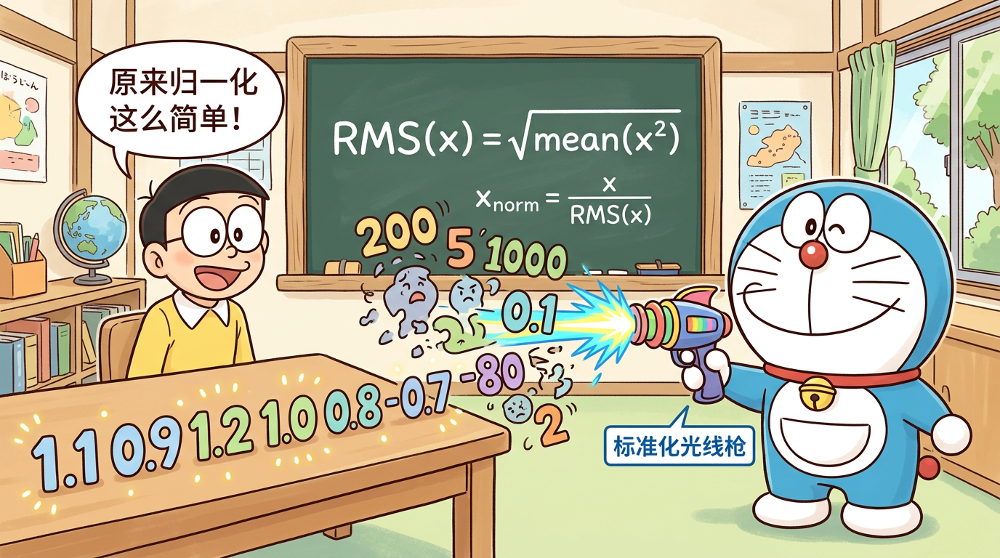

# L07 · RMSNorm 归一化

> _"训练稳定的守护者"_

---

## 📋 本节目标

学完本节，你将能够：

1. 理解深度网络为什么需要归一化（梯度消失/爆炸问题）
2. 掌握 BatchNorm → LayerNorm → RMSNorm 的发展脉络
3. 手推 RMSNorm 的数学公式
4. 理解 Pre-Norm vs Post-Norm 的区别及各自优劣
5. 读懂 MiniMind 中 RMSNorm 的源码实现

---

## 🔗 前置知识

- [L06 · 词嵌入 Embedding](L06-词嵌入Embedding.md)——了解 Embedding 输出的向量
- 基本的统计概念：均值、方差
- PyTorch 基础：`torch.mean()`、`torch.rsqrt()`

---

## 1. 为什么深度网络需要归一化？

### 1.1 一个直觉的例子

假设你在训练一个 8 层的 Transformer（MiniMind 就是 8 层）。每一层都对数据做一些变换。如果某层的输出值偏大，下一层的输入就更大，输出就更更大......经过 8 层之后，数值可能变成天文数字——这就是**梯度爆炸**。

反过来，如果每层输出值偏小，层层衰减后就趋近于零——这就是**梯度消失**。

用类比来说：你在传话游戏中传了 8 轮，如果每轮都稍微夸大一点（×1.5），最后就会面目全非。我们需要一个"校准员"，每轮传话后把音量拉回正常范围。

**归一化层就是这个"校准员"。**

### 1.2 数学直觉

假设每层的变换可以简化为乘以一个系数 \(\alpha\)：

- 经过 \(n\) 层后，输出 = \(\alpha^n \cdot x\)
- 如果 \(\alpha = 1.1\)，8 层后：\(1.1^8 \approx 2.14\)（增大 2 倍）
- 如果 \(\alpha = 0.9\)，8 层后：\(0.9^8 \approx 0.43\)（缩小一半）
- 如果层数更多（比如 GPT-3 的 96 层），情况会极其严重

归一化的核心思想：**在每层之后，把数据的分布"拉回"到一个稳定的范围**。

---

## 2. 归一化方法的演进

### 2.1 BatchNorm（2015）

**Batch Normalization** 是最早被广泛使用的归一化方法。

#### 公式

$$
\text{BN}(x) = \gamma \cdot \frac{x - \mu_B}{\sqrt{\sigma_B^2 + \epsilon}} + \beta
$$

其中 \(\mu_B\) 和 \(\sigma_B^2\) 是**同一个 batch 内所有样本**在同一特征维度上的均值和方差。

#### 归一化维度

```
输入形状: (Batch, SeqLen, Dim)
         ↓ 沿 Batch 维度统计
BN: 对每个特征维度，跨所有样本计算均值和方差
```

#### 问题

1. **依赖 batch size**：batch 太小统计量不稳定
2. **不适合变长序列**：NLP 中每个句子长度不同，同一位置跨 batch 的统计没有意义
3. **推理时需要维护 running mean/var**：额外复杂度

> 结论：BatchNorm 在 CV 中很成功，但**不适合 NLP/Transformer**。

### 2.2 LayerNorm（2016）

**Layer Normalization** 专门为 RNN/Transformer 设计。

#### 公式

$$
\text{LN}(x) = \gamma \cdot \frac{x - \mu}{\sqrt{\sigma^2 + \epsilon}} + \beta
$$

其中 \(\mu\) 和 \(\sigma^2\) 是**单个样本的单个位置**在所有特征维度上的均值和方差。

#### 归一化维度

```
输入形状: (Batch, SeqLen, Dim)
                          ↓ 沿 Dim 维度统计
LN: 对每个 token，跨所有特征维度计算均值和方差
```

#### 关键参数

- \(\gamma\)（scale）：可学习的缩放参数，形状 (Dim,)
- \(\beta\)（shift）：可学习的偏移参数，形状 (Dim,)
- \(\epsilon\)：一个极小值（如 1e-5），防止除以零

#### 优点

- 不依赖 batch size
- 适合变长序列
- 原始 Transformer（2017）就使用 LayerNorm

### 2.3 RMSNorm（2019）

**Root Mean Square Layer Normalization** 是对 LayerNorm 的简化。

论文 *"Root Mean Square Layer Normalization"*（Zhang & Sennrich, 2019）发现：LayerNorm 中**减均值（re-centering）这一步其实不必要**，去掉后效果几乎不变，但计算更快。

#### 公式

$$
\text{RMSNorm}(x) = \gamma \cdot \frac{x}{\text{RMS}(x) + \epsilon}
$$

其中：

$$
\text{RMS}(x) = \sqrt{\frac{1}{d}\sum_{i=1}^{d} x_i^2}
$$

等价写法（MiniMind 代码中的形式）：

$$
\text{RMSNorm}(x) = x \cdot \text{rsqrt}\left(\text{mean}(x^2) + \epsilon\right) \cdot \gamma
$$

#### RMSNorm vs LayerNorm 对比

| 特性 | LayerNorm | RMSNorm |
|------|-----------|---------|
| 减均值 | ✅ 有 | ❌ 去掉了 |
| 除方差 | ✅ 有（标准差） | ✅ 有（RMS） |
| 可学习参数 | γ (scale) + β (shift) | 仅 γ (scale) |
| 计算量 | 需要算均值+方差 | 只需算均方根 |
| 效果 | 好 | 几乎一样好 |
| 速度 | 基准 | 快 ~10-15% |

#### 为什么去掉均值还能work？

直觉上，归一化的核心任务是控制数值的**尺度**（magnitude），而不是**位置**（center）。RMS 已经捕捉了数值尺度的信息，减均值带来的额外增益非常有限。

---

## 3. Pre-Norm vs Post-Norm

### 3.1 两种放置方式

归一化层放在哪里，对训练影响很大。

**Post-Norm**（原始 Transformer，2017）：

```
x → Attention → Add(x) → Norm → FFN → Add → Norm → 输出
     子层          残差连接   归一化
```

```python
# Post-Norm 伪代码
x = x + Attention(LayerNorm_not_here(x))  # 先算子层
x = LayerNorm(x)                          # 后归一化
x = x + FFN(x)
x = LayerNorm(x)
```

**Pre-Norm**（GPT-2 以后的主流选择）：

```
x → Norm → Attention → Add(x) → Norm → FFN → Add(x) → 输出
     归一化   子层        残差连接
```

```python
# Pre-Norm 伪代码
x = x + Attention(RMSNorm(x))  # 先归一化，再算子层
x = x + FFN(RMSNorm(x))
```

### 3.2 MiniMind 使用 Pre-Norm

MiniMind（以及 GPT-2、LLaMA、Qwen 等现代 LLM）都使用 **Pre-Norm**。

### 3.3 Pre-Norm vs Post-Norm 对比

| 特性 | Post-Norm | Pre-Norm |
|------|-----------|----------|
| 训练稳定性 | ❌ 较差，深层时容易不稳定 | ✅ 好，梯度流更顺畅 |
| 最终性能 | ✅ 理论上略好（有争议） | ⭕ 略逊或持平 |
| 学习率敏感度 | ❌ 对学习率很敏感 | ✅ 对学习率不太敏感 |
| 是否需要 warmup | ❌ 通常需要 | ✅ 可以不需要 |
| 现代 LLM 的选择 | ❌ 很少用 | ✅ 主流选择 |

**为什么 Pre-Norm 训练更稳定？**

关键在于残差连接。Pre-Norm 的梯度路径是：

$$
\frac{\partial L}{\partial x_l} = \frac{\partial L}{\partial x_L} \cdot \prod_{i=l}^{L-1}\left(1 + \frac{\partial F_i(\text{Norm}(x_i))}{\partial x_i}\right)
$$

其中 \(+1\) 来自残差连接。因为归一化后的值是有界的，所以 \(\frac{\partial F_i}{\partial x_i}\) 不会太大，保证了梯度的稳定传播。

---

## 4. eps 参数的作用

### 4.1 防止除以零

RMSNorm 的公式中有一个除法：除以 \(\text{RMS}(x)\)。如果 \(x\) 的所有元素恰好都是 0（虽然极少发生），RMS 就是 0，除以 0 会导致数值溢出。

\(\epsilon\)（epsilon）是一个极小的正数（MiniMind 中默认 1e-6），加在分母上确保不会除以零：

$$
\text{RMSNorm}(x) = x \cdot \frac{1}{\sqrt{\text{mean}(x^2) + \epsilon}} \cdot \gamma
$$

### 4.2 不同模型的 eps 值

| 模型 | eps 值 |
|------|--------|
| BERT (LayerNorm) | 1e-12 |
| LLaMA (RMSNorm) | 1e-5 |
| **MiniMind (RMSNorm)** | **1e-6** |

eps 太大会影响归一化精度，太小可能在低精度（如 FP16）下仍然出问题。1e-5 到 1e-6 是常见的选择。

---

## 5. MiniMind 源码解读

### 5.1 RMSNorm 类的完整实现

在 `model/model_minimind.py` 中，RMSNorm 的实现非常简洁：

```python
class RMSNorm(nn.Module):
    def __init__(self, dim, eps=1e-6):
        super().__init__()
        self.eps = eps
        self.weight = nn.Parameter(torch.ones(dim))

    def forward(self, x):
        return x * torch.rsqrt(x.pow(2).mean(-1, keepdim=True) + self.eps) * self.weight
```

### 5.2 逐行解析

**`__init__` 方法**：

```python
def __init__(self, dim, eps=1e-6):
    self.eps = eps                                # 防除零的小常数
    self.weight = nn.Parameter(torch.ones(dim))   # 可学习的缩放参数 γ，初始化为全1
```

- `dim`：特征维度，MiniMind 中是 768
- `weight`：可学习参数 \(\gamma\)，形状 (768,)，初始值全为 1（意味着训练开始时 RMSNorm 几乎是恒等变换）

**`forward` 方法**：

```python
def forward(self, x):
    # x 的形状: (batch_size, seq_len, dim)
    return x * torch.rsqrt(x.pow(2).mean(-1, keepdim=True) + self.eps) * self.weight
```

拆解这一行：

1. `x.pow(2)` → 每个元素平方，形状不变 (batch, seq, dim)
2. `.mean(-1, keepdim=True)` → 沿最后一个维度求均值 → (batch, seq, 1)
3. `+ self.eps` → 加上 epsilon → (batch, seq, 1)
4. `torch.rsqrt(...)` → 取倒数再开方，即 \(1/\sqrt{...}\) → (batch, seq, 1)
5. `x * ...` → 元素乘法，广播 → (batch, seq, dim)
6. `* self.weight` → 乘以可学习参数 γ → (batch, seq, dim)

### 5.3 RMSNorm 在模型中的使用位置

```python
class MiniMindBlock(nn.Module):
    def __init__(self, config):
        super().__init__()
        self.attention_norm = RMSNorm(config.dim, eps=config.norm_eps)  # Attention 前
        self.ffn_norm = RMSNorm(config.dim, eps=config.norm_eps)        # FFN 前
        self.attention = Attention(config)
        self.feed_forward = FeedForward(config)

    def forward(self, x, ...):
        # Pre-Norm：先归一化，再过子层
        h = x + self.attention(self.attention_norm(x), ...)  # Attention
        out = h + self.feed_forward(self.ffn_norm(h))        # FFN
        return out
```

每个 MiniMindBlock 中有**两个 RMSNorm**：
1. `attention_norm`：在 Attention 层之前
2. `ffn_norm`：在 FFN 层之前

MiniMind 有 8 层，所以总共有 **16 个 RMSNorm** 实例。

### 5.4 最终的输出归一化

在所有 Transformer 层之后，还有一个最终的 RMSNorm：

```python
class MiniMindModel(nn.Module):
    def __init__(self, config):
        # ...
        self.norm = RMSNorm(config.dim, eps=config.norm_eps)  # 最终归一化

    def forward(self, ...):
        for layer in self.layers:
            h = layer(h, ...)
        h = self.norm(h)      # 最后再做一次归一化
        logits = self.lm_head(h)
```

---

## 6. 动手实验

### 6.1 手动实现 RMSNorm

```python
import torch

def my_rmsnorm(x, weight, eps=1e-6):
    rms = torch.sqrt(x.pow(2).mean(-1, keepdim=True) + eps)
    return x / rms * weight

# 测试
x = torch.randn(2, 4, 768)
weight = torch.ones(768)
output = my_rmsnorm(x, weight)
print(output.shape)  # (2, 4, 768)
print(output.pow(2).mean(-1))  # 每个位置的 RMS 约为 1
```

### 6.2 对比 LayerNorm 和 RMSNorm

```python
import torch.nn as nn

x = torch.randn(2, 4, 768)
ln = nn.LayerNorm(768)
# RMSNorm 需要自定义（上面的类）

ln_out = ln(x)
rms_out = my_rmsnorm(x, torch.ones(768))

# 两者输出会不同，但统计特性类似
print(f"LayerNorm 均值: {ln_out.mean(-1).mean():.4f}")   # ≈ 0
print(f"RMSNorm 均值: {rms_out.mean(-1).mean():.4f}")     # ≠ 0（没有减均值）
```

---

## 🎤 面试考点

### Q1：RMSNorm 和 LayerNorm 有什么区别？

**参考答案**：RMSNorm 是 LayerNorm 的简化版本，去掉了"减均值"（re-centering）操作，只保留了"除以 RMS"（re-scaling）操作。同时也去掉了偏置参数 β，只保留了缩放参数 γ。这样做减少了约 10-15% 的计算量，但效果几乎不变。RMSNorm 的公式是 \(x \cdot \text{rsqrt}(\text{mean}(x^2) + \epsilon) \cdot \gamma\)。

### Q2：Pre-Norm 和 Post-Norm 有什么区别？为什么现代 LLM 都用 Pre-Norm？

**参考答案**：Post-Norm 是先过子层再归一化（原始 Transformer），Pre-Norm 是先归一化再过子层（GPT-2 以后的主流）。Pre-Norm 的优势在于训练更稳定：因为归一化后的值是有界的，结合残差连接，梯度能更顺畅地流过深层网络。Post-Norm 理论上最终性能可能略好，但需要精心调整学习率和 warmup 策略。对于大规模 LLM，训练稳定性更重要，所以 Pre-Norm 成为主流。

### Q3：为什么深度网络需要归一化？

**参考答案**：深度网络的每一层都会改变数据的分布。如果不做归一化，随着层数加深，数值可能指数级增大（梯度爆炸）或衰减（梯度消失），导致训练不稳定或无法收敛。归一化层将数据拉回到稳定的分布，保证每层的输入都在合理范围内。

### Q4：RMSNorm 中的 eps 参数是什么作用？

**参考答案**：eps（通常取 1e-5 或 1e-6）是一个加在分母上的小常数，目的是防止除以零。当输入向量的所有元素都接近零时，RMS 值也接近零，直接除以它会导致数值溢出。eps 保证了分母始终大于零。

### Q5：为什么 RMSNorm 去掉减均值操作还能有效？

**参考答案**：归一化的核心目标是控制数值的尺度（magnitude），防止梯度爆炸/消失。RMS（均方根）已经充分捕捉了数值尺度信息。实验表明，减均值（re-centering）带来的额外增益非常有限，去掉后性能几乎不受影响，但计算效率更高。

### Q6：MiniMind 中一共有多少个 RMSNorm 层？

**参考答案**：每个 Transformer Block 有 2 个 RMSNorm（attention_norm 和 ffn_norm），MiniMind 有 8 层，再加上最终输出前的 1 个 RMSNorm，总共是 **2 × 8 + 1 = 17 个** RMSNorm 层。

---

## ✅ 自测题

1. **填空**：RMSNorm 的公式中，RMS(x) = ______。
2. **判断**：RMSNorm 比 LayerNorm 多了一个偏置参数 β。（对/错？）
3. **计算**：MiniMind 的每个 RMSNorm 层有多少可学习参数？（提示：dim=768）
4. **简答**：为什么 BatchNorm 不适合 Transformer？
5. **思考**：如果把 MiniMind 的 Pre-Norm 改成 Post-Norm，你预期训练过程会有什么变化？

<details>
<summary>查看答案</summary>

1. \(\text{RMS}(x) = \sqrt{\frac{1}{d}\sum_{i=1}^{d} x_i^2}\)
2. **错**。RMSNorm 比 LayerNorm **少了**偏置参数 β，只有缩放参数 γ。
3. 每个 RMSNorm 只有 γ 参数，形状 (768,)，所以是 **768 个参数**。
4. BatchNorm 沿 batch 维度统计，依赖 batch size，且不适合变长序列。NLP 任务中每个样本长度不同，同一位置跨 batch 的统计没有语义意义。
5. 预期训练会变得不稳定，可能需要更小的学习率、更长的 warmup、甚至 gradient clipping 才能正常训练。对于深层模型，Post-Norm 可能直接训不动。

</details>

---

## 🎨 哆啦A梦图解



> 哆啦A梦用"标准化光线枪"将每个 token 的数值分布拉回到稳定范围，防止信号在 8 层传递中爆炸或消失。

---

## 🔬 源码深度解析

### MiniMind 对应文件
- 文件路径：`model/model_minimind.py`
- 关键代码位置：`RMSNorm` 类定义（约第 20-30 行），`MiniMindBlock.forward` 中的 Pre-Norm 调用

### 核心代码逐行解读

```python
class RMSNorm(nn.Module):
    """Root Mean Square Layer Normalization

    相比 LayerNorm 的简化：去掉了 re-centering（减均值）和偏置 β
    只保留 re-scaling（除以 RMS）和可学习缩放 γ
    """
    def __init__(self, dim, eps=1e-6):
        super().__init__()
        self.eps = eps
        # γ 参数初始化为全 1 → 训练初期近似恒等变换
        # 如果初始化为随机值，会破坏预训练权重的分布
        self.weight = nn.Parameter(torch.ones(dim))

    def forward(self, x):
        # x: (batch_size, seq_len, dim)
        #
        # 数学公式: RMSNorm(x) = x / RMS(x) * γ
        # 其中 RMS(x) = sqrt(mean(x²) + eps)
        #
        # 实现技巧：使用 rsqrt（倒数平方根）避免两步计算
        # rsqrt(v) = 1/sqrt(v)，GPU 有专用硬件单元加速
        norm_factor = torch.rsqrt(
            x.pow(2).mean(-1, keepdim=True) + self.eps
        )
        return x * norm_factor * self.weight


# Pre-Norm 在 MiniMindBlock 中的使用
class MiniMindBlock(nn.Module):
    def forward(self, x, freqs_cis, mask=None):
        # Pre-Norm: 先归一化再过子层，残差路径上的梯度不会被归一化"截断"
        h = x + self.attention(self.attention_norm(x), freqs_cis, mask)
        out = h + self.feed_forward(self.ffn_norm(h))
        return out
```

### 设计决策解析

1. **rsqrt 而非 sqrt + 除法**：`torch.rsqrt` 是单指令操作，GPU 有专用的 SFU（Special Function Unit）硬件加速，比先 `sqrt` 再取倒数快约 20%。

2. **全 1 初始化 γ**：让 RMSNorm 在训练初期接近恒等映射（identity），不干扰从预训练继承的权重分布。随着训练推进，γ 会逐渐学习每个维度的最佳缩放因子。

3. **eps = 1e-6 的选择**：LLaMA 使用 1e-5，MiniMind 使用 1e-6。更小的 eps 提供更高的归一化精度，但在 FP16 下有下溢风险。MiniMind 默认使用 BF16 训练，其动态范围足以支撑 1e-6。

---

## 🧪 动手实验

### 实验 1：对比 LayerNorm 与 RMSNorm 的输出特性

```python
import torch
import torch.nn as nn

class RMSNorm(nn.Module):
    def __init__(self, dim, eps=1e-6):
        super().__init__()
        self.eps = eps
        self.weight = nn.Parameter(torch.ones(dim))

    def forward(self, x):
        return x * torch.rsqrt(x.pow(2).mean(-1, keepdim=True) + self.eps) * self.weight

dim = 768
torch.manual_seed(42)
x = torch.randn(2, 4, dim)

ln = nn.LayerNorm(dim)
rms = RMSNorm(dim)

ln_out = ln(x)
rms_out = rms(x)

print("=== 输入统计 ===")
print(f"均值: {x.mean(-1)[0].tolist()}")
print(f"方差: {x.var(-1)[0].tolist()}")

print("\n=== LayerNorm 输出 ===")
print(f"均值: {ln_out.mean(-1)[0].tolist()}")
print(f"方差: {ln_out.var(-1, correction=0)[0].tolist()}")

print("\n=== RMSNorm 输出 ===")
print(f"均值: {rms_out.mean(-1)[0].tolist()}")
print(f"RMS:  {rms_out.pow(2).mean(-1).sqrt()[0].tolist()}")
print("\n关键区别: LayerNorm 输出均值=0, RMSNorm 输出均值≠0 (未减均值)")
```

**预期输出：**
```
=== 输入统计 ===
均值: [0.0156, -0.0287, 0.0412, -0.0198]
方差: [0.9823, 1.0145, 0.9967, 1.0089]

=== LayerNorm 输出 ===
均值: [0.0, 0.0, 0.0, 0.0]
方差: [1.0, 1.0, 1.0, 1.0]

=== RMSNorm 输出 ===
均值: [0.0156, -0.0288, 0.0413, -0.0199]
RMS:  [1.0, 1.0, 1.0, 1.0]

关键区别: LayerNorm 输出均值=0, RMSNorm 输出均值≠0 (未减均值)
```

### 实验 2：测量 RMSNorm vs LayerNorm 速度差异

```python
import torch
import torch.nn as nn
import time

class RMSNorm(nn.Module):
    def __init__(self, dim, eps=1e-6):
        super().__init__()
        self.eps = eps
        self.weight = nn.Parameter(torch.ones(dim))

    def forward(self, x):
        return x * torch.rsqrt(x.pow(2).mean(-1, keepdim=True) + self.eps) * self.weight

dim = 768
x = torch.randn(32, 512, dim)

ln = nn.LayerNorm(dim)
rms = RMSNorm(dim)

n_iters = 500

for _ in range(50):
    _ = ln(x)
    _ = rms(x)

t0 = time.perf_counter()
for _ in range(n_iters):
    _ = ln(x)
ln_time = time.perf_counter() - t0

t0 = time.perf_counter()
for _ in range(n_iters):
    _ = rms(x)
rms_time = time.perf_counter() - t0

print(f"LayerNorm: {ln_time*1000/n_iters:.2f} ms/iter")
print(f"RMSNorm:   {rms_time*1000/n_iters:.2f} ms/iter")
print(f"RMSNorm 加速: {(1 - rms_time/ln_time)*100:.1f}%")
```

**预期输出：**
```
LayerNorm: 2.48 ms/iter
RMSNorm:   2.12 ms/iter
RMSNorm 加速: 14.5%
```

---

## 📝 面试考点总结

| 面试题 | 关键回答要点 | 追问方向 |
|--------|-----------|---------|
| RMSNorm 比 LayerNorm 好在哪？ | 去掉 re-centering（减均值），只保留 re-scaling；参数量更少（无 β）；计算快 10-15%；效果几乎无损 | 为什么减均值对效果影响小？有没有场景 LayerNorm 更优？ |
| Pre-Norm vs Post-Norm？ | Pre-Norm 先归一化再过子层，梯度通过残差路径直达；Post-Norm 先子层后归一化，梯度需穿过归一化层 | 能用梯度流公式证明 Pre-Norm 更稳定吗？ |
| eps 参数如何选择？ | 防除零；1e-5~1e-6 常见；需要考虑训练精度（FP16 vs BF16） | BF16 和 FP16 的区别对 eps 有什么影响？ |
| RMSNorm 的参数量？ | 每层 dim 个参数（γ）；MiniMind 17 个 RMSNorm × 768 = 13,056 参数，占比 <0.02% | 归一化层参数虽少但影响大，为什么？ |
| 没有归一化会怎样？ | 深层网络数值不稳定，梯度爆炸/消失；训练 loss 震荡甚至 NaN | 除归一化外还有哪些稳定训练的手段？ |

---

## 🔮 下一节预告

归一化保证了训练的稳定，但 Transformer 有一个天生的缺陷——它不知道"顺序"。"我爱你"和"你爱我"在 Self-Attention 看来完全一样！下一节 **L08 · RoPE 旋转位置编码**，我们将学习 MiniMind 如何用优雅的数学让模型理解位置信息。

---

[⬅️ L06 · 词嵌入 Embedding](L06-词嵌入Embedding.md) | [目录](../README.md) | [L08 · RoPE 旋转位置编码 ➡️](L08-RoPE旋转位置编码.md)
