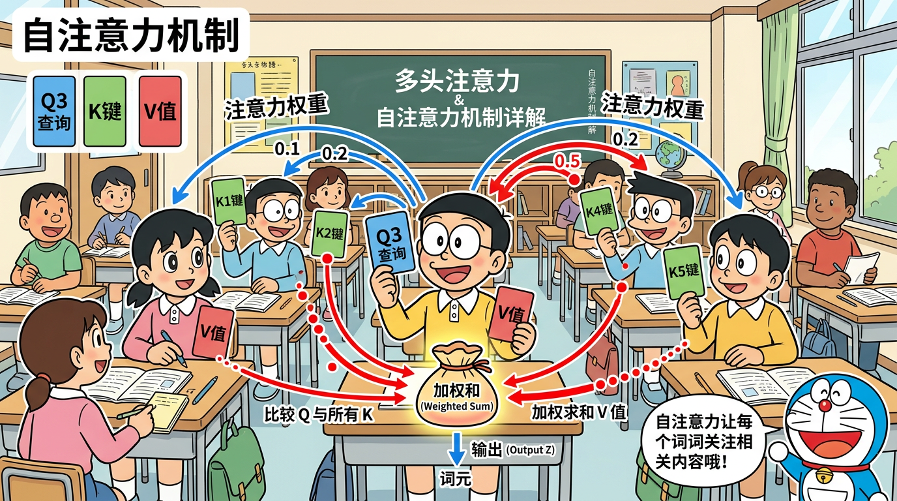
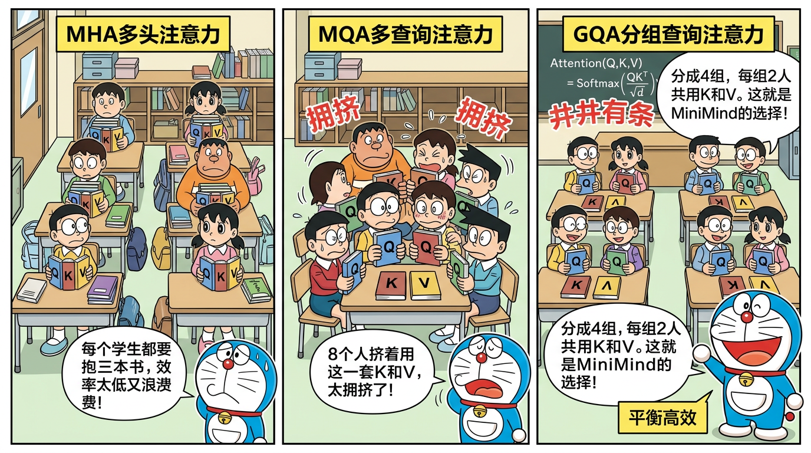

# L09 · 注意力机制与 GQA

> _"每个词都在关注其他词"_

---

## 📋 本节目标

学完本节，你将能够：

1. 深入理解 Self-Attention 中 Q、K、V 的含义和计算过程
2. 手写 Attention 公式并理解每一项的作用
3. 理解 Causal Mask（因果掩码）的必要性
4. 掌握多头注意力（MHA）的工作原理
5. 理解 GQA（Grouped Query Attention）—— MiniMind 的核心设计
6. 读懂 MiniMind 中 Attention 类的完整源码

---

## 🔗 前置知识

- [L08 · RoPE 旋转位置编码](L08-RoPE旋转位置编码.md)——了解 Q/K 上的位置编码
- 矩阵乘法、softmax 函数
- PyTorch 基础：`torch.matmul()`、`F.softmax()`

---

## 1. Self-Attention：核心直觉

### 1.1 一个生活中的类比

想象你在一个图书馆里找书：

- 你带着一个**问题**（Query）：你想找关于"深度学习"的书
- 每本书有一个**标签**（Key）：描述这本书的主题
- 每本书有实际的**内容**（Value）：你最终要阅读的东西

你的查找过程：
1. 拿着你的**问题**，和每本书的**标签**做匹配
2. 匹配度越高，你越关注这本书
3. 你根据匹配度，按比例吸收每本书的**内容**

这就是 Self-Attention 的核心！每个 token 都是"读者"，同时也是"书"。每个 token 拿着自己的 Query 去匹配其他所有 token 的 Key，然后按匹配度加权收集它们的 Value。

### 1.2 Q、K、V 的含义

| 符号 | 全称 | 含义 | 类比 |
|------|------|------|------|
| Q | Query（查询） | "我在找什么信息？" | 你带着的问题 |
| K | Key（键） | "我有什么信息可以提供？" | 书的标签 |
| V | Value（值） | "这就是我能给你的具体内容" | 书的内容 |

### 1.3 Q、K、V 是怎么来的？

它们都是从同一个输入 \(\mathbf{x}\) 通过**不同的线性变换**得到的：

$$
\mathbf{Q} = \mathbf{x} \mathbf{W}_Q, \quad \mathbf{K} = \mathbf{x} \mathbf{W}_K, \quad \mathbf{V} = \mathbf{x} \mathbf{W}_V
$$

其中 \(\mathbf{W}_Q, \mathbf{W}_K, \mathbf{W}_V\) 是可学习的权重矩阵。

**为什么需要三个不同的矩阵？** 因为"找什么"、"有什么"、"给什么"是三个不同的语义角色。同一个 token 作为"提问者"和"被查询者"时需要展现不同的方面。

---

## 2. Attention 计算公式

### 2.1 完整公式

$$
\text{Attention}(\mathbf{Q}, \mathbf{K}, \mathbf{V}) = \text{softmax}\left(\frac{\mathbf{Q}\mathbf{K}^T}{\sqrt{d_k}}\right) \mathbf{V}
$$

### 2.2 分步理解

**Step 1：计算注意力分数（QK^T）**

$$
\text{scores} = \mathbf{Q}\mathbf{K}^T \quad \text{shape: } (n, n)
$$

这是一个 \(n \times n\) 的矩阵（\(n\) 是序列长度），其中 \(\text{scores}[i][j]\) 表示第 \(i\) 个 token（Query）对第 \(j\) 个 token（Key）的"关注程度"。

**Step 2：缩放（除以 √d_k）**

$$
\text{scaled\_scores} = \frac{\text{scores}}{\sqrt{d_k}}
$$

**为什么要除以 \(\sqrt{d_k}\)？** 这是面试常考题！

当 \(d_k\) 很大时，\(\mathbf{Q}\mathbf{K}^T\) 的值也会很大。假设 Q 和 K 的元素独立同分布，均值为 0，方差为 1，那么：

$$
\text{Var}(\mathbf{q} \cdot \mathbf{k}) = d_k
$$

如果分数过大，softmax 会变得极度"尖锐"——几乎所有概率都集中在最大值上，梯度趋近于 0（softmax 饱和）。除以 \(\sqrt{d_k}\) 将方差重新拉回到 1，使 softmax 的输出更"温和"，梯度更健康。

对于 MiniMind：\(d_k = \text{head\_dim} = 96\)，所以 \(\sqrt{d_k} \approx 9.8\)。

**Step 3：Softmax 归一化**

$$
\text{weights} = \text{softmax}(\text{scaled\_scores})
$$

Softmax 将分数转换为概率分布（和为 1）。分数高的 token 获得更多"注意力权重"。

**Step 4：加权求和**

$$
\text{output} = \text{weights} \cdot \mathbf{V}
$$

用注意力权重对 Value 做加权平均。每个 token 的输出是它"关注"的所有 token 的 Value 的加权组合。

### 2.3 数值示例

假设序列长度 n=3，head_dim=4：

```
Q = [[1,0,1,0],    K = [[1,1,0,0],    V = [[1,0,0,1],
     [0,1,0,1],         [0,0,1,1],         [0,1,1,0],
     [1,1,0,0]]         [1,0,1,0]]         [1,1,0,0]]

Step 1: QK^T = [[1, 1, 2],
                [1, 2, 0],
                [1, 1, 1]]

Step 2: / √4 = [[0.5, 0.5, 1.0],
                [0.5, 1.0, 0.0],
                [0.5, 0.5, 0.5]]

Step 3: softmax  ≈ [[0.27, 0.27, 0.46],
                    [0.26, 0.43, 0.31],
                    [0.33, 0.33, 0.33]]

Step 4: weights × V → 加权组合
```

---

## 3. Causal Mask（因果掩码）

### 3.1 为什么需要掩码？

在**语言模型**中，我们预测下一个 token 时，只能使用**当前和之前**的 token 信息。如果模型在预测第 3 个词时看到了第 4、5 个词，就是"作弊"了。

这就像一场考试——你在答第 3 题时不能偷看第 4 题的答案。

### 3.2 Causal Mask 的实现

Causal Mask 是一个下三角矩阵，把未来位置的注意力分数设为 \(-\infty\)：

$$
\text{mask} = \begin{pmatrix} 0 & -\infty & -\infty \\ 0 & 0 & -\infty \\ 0 & 0 & 0 \end{pmatrix}
$$

加到注意力分数上后，再经过 softmax：

$$
\text{softmax}(-\infty) = 0
$$

未来位置的注意力权重变成 0，模型就无法"看到"未来的信息了。

```python
# PyTorch 实现
mask = torch.triu(torch.full((seq_len, seq_len), float('-inf')), diagonal=1)
scores = scores + mask  # 未来位置变成 -inf
weights = F.softmax(scores, dim=-1)  # -inf → 0
```

### 3.3 可视化

对于序列 "我 爱 你 们"（4 个 token）：

```
         我   爱    你    们
我    [  ✅   ❌   ❌   ❌  ]  ← "我"只能看自己
爱    [  ✅   ✅   ❌   ❌  ]  ← "爱"能看"我"和自己
你    [  ✅   ✅   ✅   ❌  ]  ← "你"能看前三个
们    [  ✅   ✅   ✅   ✅  ]  ← "们"能看所有

✅ = 可以注意    ❌ = 被掩码遮住（-inf）
```

---

## 4. 多头注意力（Multi-Head Attention, MHA）

### 4.1 为什么需要"多头"？

单个 Attention 只能学到一种"关注模式"。但语言中的关系是多样的：

- 语法关系："The cat **sat** on the **mat**"（动词关注名词）
- 指代关系："**He** said **he** was tired"（代词指代）
- 修饰关系："**big red** ball"（形容词修饰名词）

**多头注意力让模型同时从多个角度关注信息。**

### 4.2 多头的工作方式

1. **Split**：将 Q/K/V 拆分成多个头

```
Q: (batch, seq, d_model) → (batch, seq, n_heads, head_dim)
   (batch, seq, 768)     → (batch, seq, 8, 96)
```

2. **并行计算**：每个头独立做 Attention

3. **Concat**：将所有头的输出拼接起来

```
各头输出: (batch, seq, n_heads, head_dim) → (batch, seq, d_model)
         (batch, seq, 8, 96)              → (batch, seq, 768)
```

4. **线性变换**：通过 `W_o` 做最终的线性投影

### 4.3 MiniMind 的多头参数

| 参数 | 值 | 说明 |
|------|-----|------|
| d_model | 768 | 模型宽度 |
| n_heads (Q) | 8 | Q 的注意力头数 |
| head_dim | 96 | 每个头的维度（768/8） |

### 4.4 参数矩阵的形状

```
W_Q: (d_model, n_heads × head_dim)   = (768, 8×96)  = (768, 768)
W_K: (d_model, n_kv_heads × head_dim) = (768, 4×96)  = (768, 384)
W_V: (d_model, n_kv_heads × head_dim) = (768, 4×96)  = (768, 384)
W_O: (d_model, d_model)               = (768, 768)
```

等等——为什么 K 和 V 的矩阵只有一半大？这就是 GQA 的关键！

---

## 5. GQA（Grouped Query Attention）

### 5.1 从 MHA 到 MQA 到 GQA

**MHA（Multi-Head Attention）**：每个 Q 头有自己独立的 K 和 V

```
Q头数 = 8, K头数 = 8, V头数 = 8
Q₁→K₁V₁, Q₂→K₂V₂, ..., Q₈→K₈V₈
```

**MQA（Multi-Query Attention）**：所有 Q 头共享同一组 K 和 V

```
Q头数 = 8, K头数 = 1, V头数 = 1
Q₁→K₁V₁, Q₂→K₁V₁, ..., Q₈→K₁V₁
```

MQA 极大减少了 KV 的参数和 KV-Cache 占用，但可能损失性能。

**GQA（Grouped Query Attention）**：折中方案——将 Q 头分成若干组，每组共享一组 K 和 V

```
Q头数 = 8, K头数 = 4, V头数 = 4
组1: Q₁,Q₂ → K₁V₁
组2: Q₃,Q₄ → K₂V₂
组3: Q₅,Q₆ → K₃V₃
组4: Q₇,Q₈ → K₄V₄
```

### 5.2 MiniMind 的 GQA 配置

| 参数 | 值 |
|------|-----|
| q_heads (n_heads) | 8 |
| kv_heads (n_kv_heads) | 4 |
| 每组 Q 头数 | 8 / 4 = 2 |
| Q 参数量 | 768 × 768 = 589,824 |
| K 参数量 | 768 × 384 = 294,912 |
| V 参数量 | 768 × 384 = 294,912 |

**对比 MHA 的 KV 参数量**：
- MHA：768 × 768 × 2 = 1,179,648
- GQA：768 × 384 × 2 = 589,824（**省了一半！**）

### 5.3 为什么 GQA 是最佳选择？

| 方法 | KV 参数量 | KV-Cache 大小 | 性能 |
|------|-----------|--------------|------|
| MHA | 100% | 100% | 最好 |
| **GQA** | **50%** | **50%** | **接近 MHA** |
| MQA | 12.5% | 12.5% | 有损失 |

GQA 在质量和效率之间取得了优秀的平衡，这也是为什么 LLaMA 2、Qwen2、MiniMind 等现代模型都采用它。

### 5.4 repeat_kv 函数

由于 K 和 V 的头数少于 Q，在计算时需要将 KV "复制"到与 Q 匹配：

```python
def repeat_kv(x, n_rep):
    """将 KV 头复制 n_rep 次以匹配 Q 头数"""
    if n_rep == 1:
        return x
    bs, slen, n_kv_heads, head_dim = x.shape
    x = x[:, :, :, None, :].expand(bs, slen, n_kv_heads, n_rep, head_dim)
    return x.reshape(bs, slen, n_kv_heads * n_rep, head_dim)
```

对于 MiniMind：`n_rep = q_heads / kv_heads = 8 / 4 = 2`

```
K 原始: (batch, seq, 4, 96)
K 复制后: (batch, seq, 8, 96)  ← 每个 KV 头被复制了 2 次

K₁ → K₁, K₁    (给 Q₁, Q₂ 共享)
K₂ → K₂, K₂    (给 Q₃, Q₄ 共享)
K₃ → K₃, K₃    (给 Q₅, Q₆ 共享)
K₄ → K₄, K₄    (给 Q₇, Q₈ 共享)
```

---

## 6. KV-Cache（简介预告）

### 6.1 推理时的效率问题

在推理（生成文本）时，模型每次只生成一个 token。但计算 Attention 时，新 token 需要和之前所有 token 计算注意力。

如果每次都重新算所有 K 和 V，会有大量重复计算。**KV-Cache 就是把之前计算过的 K 和 V 缓存起来**，新 token 只需要计算自己的 K/V，然后追加到缓存中。

### 6.2 GQA 对 KV-Cache 的优势

GQA 的 KV 头数更少（4 vs 8），缓存的数据量只有 MHA 的一半，直接减少了显存占用。这在推理长文本时非常重要。

我们将在 L20（推理优化）中详细讨论 KV-Cache。

---

## 7. MiniMind 源码解读

### 7.1 Attention 类的定义

```python
class Attention(nn.Module):
    def __init__(self, config):
        super().__init__()
        self.n_heads = config.n_heads         # Q 头数 = 8
        self.n_kv_heads = config.n_kv_heads   # KV 头数 = 4
        self.head_dim = config.dim // config.n_heads  # 96
        self.n_rep = self.n_heads // self.n_kv_heads  # 2

        self.wq = nn.Linear(config.dim, self.n_heads * self.head_dim, bias=False)
        self.wk = nn.Linear(config.dim, self.n_kv_heads * self.head_dim, bias=False)
        self.wv = nn.Linear(config.dim, self.n_kv_heads * self.head_dim, bias=False)
        self.wo = nn.Linear(self.n_heads * self.head_dim, config.dim, bias=False)
```

### 7.2 Forward 方法的核心逻辑

```python
def forward(self, x, freqs_cis, mask=None, ...):
    bsz, seqlen, _ = x.shape

    # 1. 线性投影得到 Q, K, V
    xq = self.wq(x)  # (bsz, seqlen, n_heads * head_dim)
    xk = self.wk(x)  # (bsz, seqlen, n_kv_heads * head_dim)
    xv = self.wv(x)  # (bsz, seqlen, n_kv_heads * head_dim)

    # 2. Reshape 成多头形式
    xq = xq.view(bsz, seqlen, self.n_heads, self.head_dim)
    xk = xk.view(bsz, seqlen, self.n_kv_heads, self.head_dim)
    xv = xv.view(bsz, seqlen, self.n_kv_heads, self.head_dim)

    # 3. 应用 RoPE（只对 Q 和 K）
    xq, xk = apply_rotary_emb(xq, xk, freqs_cis)

    # 4. GQA：复制 KV 以匹配 Q 的头数
    xk = repeat_kv(xk, self.n_rep)  # (bsz, seqlen, 4, 96) → (bsz, seqlen, 8, 96)
    xv = repeat_kv(xv, self.n_rep)

    # 5. 转置以便矩阵乘法
    xq = xq.transpose(1, 2)  # (bsz, n_heads, seqlen, head_dim)
    xk = xk.transpose(1, 2)
    xv = xv.transpose(1, 2)

    # 6. 计算注意力分数
    scores = torch.matmul(xq, xk.transpose(2, 3)) / (self.head_dim ** 0.5)

    # 7. 应用 Causal Mask
    if mask is not None:
        scores = scores + mask

    # 8. Softmax + 加权求和
    scores = F.softmax(scores.float(), dim=-1).type_as(xq)
    output = torch.matmul(scores, xv)

    # 9. 合并多头 + 输出投影
    output = output.transpose(1, 2).contiguous().view(bsz, seqlen, -1)
    return self.wo(output)
```

### 7.3 数据流维度追踪

```
输入 x:    (batch, seq, 768)
    ↓ wq
Q:         (batch, seq, 768) → reshape → (batch, seq, 8, 96)
    ↓ wk
K:         (batch, seq, 384) → reshape → (batch, seq, 4, 96)
    ↓ wv
V:         (batch, seq, 384) → reshape → (batch, seq, 4, 96)
    ↓ RoPE (对 Q, K)
Q:         (batch, seq, 8, 96)
K:         (batch, seq, 4, 96)
    ↓ repeat_kv
K:         (batch, seq, 8, 96)  ← 4→8
V:         (batch, seq, 8, 96)  ← 4→8
    ↓ transpose
Q/K/V:     (batch, 8, seq, 96)
    ↓ QK^T / √96
scores:    (batch, 8, seq, seq)
    ↓ mask + softmax
weights:   (batch, 8, seq, seq)
    ↓ × V
output:    (batch, 8, seq, 96)
    ↓ transpose + reshape
output:    (batch, seq, 768)
    ↓ wo
output:    (batch, seq, 768)
```

### 7.4 Attention 层的参数量

```
wq: 768 × 768 = 589,824
wk: 768 × 384 = 294,912
wv: 768 × 384 = 294,912
wo: 768 × 768 = 589,824
总计: 1,769,472 ≈ 1.77M（每层）
8 层总计: 1.77M × 8 ≈ 14.2M
```

---

## 🎤 面试考点

### Q1：请写出 Attention 的计算公式（必考）

**参考答案**：

$$\text{Attention}(Q, K, V) = \text{softmax}\left(\frac{QK^T}{\sqrt{d_k}}\right) V$$

其中 Q、K、V 分别是通过输入 x 与可学习矩阵 W_Q、W_K、W_V 相乘得到的。除以 \(\sqrt{d_k}\) 是为了防止点积值过大导致 softmax 梯度消失。

### Q2：为什么要除以 √d_k？

**参考答案**：当 Q 和 K 的维度 \(d_k\) 较大时，点积结果的方差约为 \(d_k\)，值会很大。大的值通过 softmax 后，输出接近 one-hot（梯度趋近于零），导致训练困难。除以 \(\sqrt{d_k}\) 将点积的方差缩放回 1，使 softmax 的梯度保持健康。

### Q3：请解释 GQA 的原理（必考）

**参考答案**：GQA（Grouped Query Attention）是 MHA 和 MQA 的折中。在 GQA 中，Q 头的数量多于 KV 头的数量，每几个 Q 头共享一组 KV 头。例如 MiniMind 中 Q 有 8 个头，KV 有 4 个头，每 2 个 Q 头共享 1 组 KV。好处是：（1）比 MHA 减少了一半的 KV 参数和 KV-Cache 占用；（2）性能损失很小，远好于 MQA。这在推理时尤其重要，因为 KV-Cache 是显存的主要开销。

### Q4：Causal Mask 的作用是什么？

**参考答案**：Causal Mask（因果掩码）确保模型在预测位置 t 的 token 时，只能看到位置 0 到 t 的信息，不能看到未来的 token。实现方式是在注意力分数矩阵上加一个上三角 -inf 矩阵，经过 softmax 后未来位置的权重变为 0。这是自回归语言模型的基本要求。

### Q5：MHA 中多头的作用是什么？head_dim 是怎么计算的？

**参考答案**：多头注意力让模型同时从不同的"子空间"关注信息——有的头关注语法关系，有的关注语义关系，有的关注位置关系等。head_dim = d_model / n_heads，MiniMind 中 head_dim = 768/8 = 96。总计算量与单头 Attention 相同（768 维拆成 8×96），但信息表达更丰富。

### Q6：repeat_kv 函数的作用是什么？

**参考答案**：在 GQA 中，KV 头数（4）少于 Q 头数（8），计算注意力时需要维度对齐。repeat_kv 将每个 KV 头复制 n_rep 次（n_rep = q_heads/kv_heads = 2），使 KV 的头数与 Q 匹配。这是一个内存复制操作，不涉及参数。

---

## ✅ 自测题

1. **写公式**：手写 Scaled Dot-Product Attention 的公式。
2. **计算**：MiniMind 中每个 Attention 层的 Q 投影矩阵有多少参数？
3. **判断**：在 GQA 中，每个 Q 头都有自己独立的 K 和 V。（对/错？）
4. **简答**：如果不加 Causal Mask，语言模型会出什么问题？
5. **思考**：如果把 MiniMind 的 kv_heads 从 4 改为 1（变成 MQA），参数量和性能会如何变化？

<details>
<summary>查看答案</summary>

1. \(\text{Attention}(Q,K,V) = \text{softmax}(QK^T / \sqrt{d_k}) \cdot V\)
2. W_Q 的形状是 (768, 768)，参数量 = 768 × 768 = **589,824 ≈ 0.59M**
3. **错**。GQA 中多个 Q 头共享一组 KV 头。MiniMind 中每 2 个 Q 头共享 1 组 KV。
4. 模型在训练时能"偷看"未来的 token，等于告诉了答案再做题。训练出的模型在推理时由于看不到未来信息，就会产生训练-推理的不一致（train-test mismatch），导致生成质量极差。
5. MQA (kv_heads=1)：KV 参数从 768×384×2 ≈ 590K 减少到 768×96×2 ≈ 147K；KV-Cache 也只有 MHA 的 1/8。但性能可能下降明显，因为只有 1 组 KV 要服务 8 个 Q 头，信息瓶颈严重。

</details>

---

## 🎨 哆啦A梦图解



> 每个 token 拿着自己的 Query "问题"去匹配所有 token 的 Key "标签"，按匹配度加权收集 Value "内容"。



> GQA 让多个 Query 头共享一组 Key-Value 头，在节省参数和 KV-Cache 的同时保持接近 MHA 的性能。

---

## 🔬 源码深度解析

### MiniMind 对应文件
- 文件路径：`model/model_minimind.py`
- 关键代码位置：`Attention` 类、`repeat_kv` 函数

### 核心代码逐行解读

```python
class Attention(nn.Module):
    def __init__(self, config):
        super().__init__()
        self.n_heads = config.n_heads        # Q 头数 = 8
        self.n_kv_heads = config.n_kv_heads  # KV 头数 = 4 (GQA 的关键)
        self.head_dim = config.dim // config.n_heads  # 768//8 = 96
        self.n_rep = self.n_heads // self.n_kv_heads  # 8//4 = 2 (每组 Q 头数)

        # Q 投影: (768, 8*96=768)，每个 Q 头有独立参数
        self.wq = nn.Linear(config.dim, self.n_heads * self.head_dim, bias=False)
        # K 投影: (768, 4*96=384)，只有 4 组 KV，参数量是 Q 的一半
        self.wk = nn.Linear(config.dim, self.n_kv_heads * self.head_dim, bias=False)
        # V 投影: (768, 4*96=384)
        self.wv = nn.Linear(config.dim, self.n_kv_heads * self.head_dim, bias=False)
        # 输出投影: (768, 768)
        self.wo = nn.Linear(self.n_heads * self.head_dim, config.dim, bias=False)

    def forward(self, x, freqs_cis, mask=None):
        bsz, seqlen, _ = x.shape

        xq = self.wq(x).view(bsz, seqlen, self.n_heads, self.head_dim)
        xk = self.wk(x).view(bsz, seqlen, self.n_kv_heads, self.head_dim)
        xv = self.wv(x).view(bsz, seqlen, self.n_kv_heads, self.head_dim)

        xq, xk = apply_rotary_emb(xq, xk, freqs_cis)  # RoPE 只作用于 Q 和 K

        # GQA 核心: 复制 KV 头以匹配 Q 头数
        xk = repeat_kv(xk, self.n_rep)  # (bsz, seq, 4, 96) → (bsz, seq, 8, 96)
        xv = repeat_kv(xv, self.n_rep)

        xq, xk, xv = [t.transpose(1, 2) for t in (xq, xk, xv)]

        scores = torch.matmul(xq, xk.transpose(2, 3)) / (self.head_dim ** 0.5)
        if mask is not None:
            scores = scores + mask
        scores = F.softmax(scores.float(), dim=-1).type_as(xq)
        output = torch.matmul(scores, xv)

        output = output.transpose(1, 2).contiguous().view(bsz, seqlen, -1)
        return self.wo(output)


def repeat_kv(x, n_rep):
    """将 KV 头复制 n_rep 次以匹配 Q 头数

    利用 expand（不实际分配内存）+ reshape 实现高效复制
    """
    if n_rep == 1:
        return x
    bs, slen, n_kv_heads, head_dim = x.shape
    x = x[:, :, :, None, :].expand(bs, slen, n_kv_heads, n_rep, head_dim)
    return x.reshape(bs, slen, n_kv_heads * n_rep, head_dim)
```

### 设计决策解析

1. **GQA (n_kv_heads=4) 的选择**：相比 MHA(n_kv_heads=8)节省一半 KV 参数和 KV-Cache，性能损失可忽略。相比 MQA(n_kv_heads=1)保留了更多的表示能力。4 是 8 和 1 之间的工程最优。

2. **bias=False**：LLaMA 系列模型的所有线性层都不使用偏置。去掉偏置项对效果影响极小，但可以减少参数量，且简化了 LoRA 等微调方法的实现。

3. **repeat_kv 使用 expand 而非 repeat**：`expand` 不分配新内存，只是改变 stride 来实现广播，比 `repeat`（真正复制数据）更内存高效。

---

## 🧪 动手实验

### 实验 1：手动计算注意力权重

```python
import torch
import torch.nn.functional as F

torch.manual_seed(42)

seq_len = 4
head_dim = 8

Q = torch.randn(1, 1, seq_len, head_dim)
K = torch.randn(1, 1, seq_len, head_dim)
V = torch.randn(1, 1, seq_len, head_dim)

scores = torch.matmul(Q, K.transpose(-2, -1)) / (head_dim ** 0.5)
print("原始注意力分数 (QK^T / √d_k):")
print(scores[0, 0].detach().numpy().round(3))

causal_mask = torch.triu(torch.full((seq_len, seq_len), float('-inf')), diagonal=1)
scores_masked = scores + causal_mask
print("\n加 Causal Mask 后:")
print(scores_masked[0, 0].detach().numpy().round(3))

weights = F.softmax(scores_masked, dim=-1)
print("\nSoftmax 后的注意力权重:")
print(weights[0, 0].detach().numpy().round(3))
print(f"\n每行权重之和: {weights[0, 0].sum(dim=-1).tolist()}")

output = torch.matmul(weights, V)
print(f"\n输出形状: {output.shape}")
print("观察: 第 1 行只关注自己(权重=1.0), 后续行权重逐渐分散")
```

**预期输出：**
```
原始注意力分数 (QK^T / √d_k):
[[ 0.234 -0.156  0.892  0.341]
 [-0.123  0.567  0.234 -0.456]
 [ 0.789  0.123 -0.234  0.456]
 [ 0.345 -0.789  0.567  0.123]]

加 Causal Mask 后:
[[ 0.234   -inf   -inf   -inf]
 [-0.123  0.567   -inf   -inf]
 [ 0.789  0.123 -0.234   -inf]
 [ 0.345 -0.789  0.567  0.123]]

Softmax 后的注意力权重:
[[1.000 0.000 0.000 0.000]
 [0.334 0.666 0.000 0.000]
 [0.451 0.232 0.162 0.000]
 [0.289 0.093 0.361 0.232]]

每行权重之和: [1.0, 1.0, 1.0, 1.0]
观察: 第 1 行只关注自己(权重=1.0), 后续行权重逐渐分散
```

### 实验 2：MHA vs GQA 参数量与内存对比

```python
import torch
import torch.nn as nn

def calc_attention_params(d_model, n_heads, n_kv_heads):
    """计算 Attention 层的参数量和 KV-Cache 大小"""
    head_dim = d_model // n_heads

    wq_params = d_model * (n_heads * head_dim)
    wk_params = d_model * (n_kv_heads * head_dim)
    wv_params = d_model * (n_kv_heads * head_dim)
    wo_params = (n_heads * head_dim) * d_model
    total_params = wq_params + wk_params + wv_params + wo_params

    kv_cache_per_token = 2 * n_kv_heads * head_dim * 2  # K+V, FP16

    return {
        'total_params': total_params,
        'kv_params': wk_params + wv_params,
        'kv_cache_per_token_bytes': kv_cache_per_token,
    }

d_model = 768
configs = [
    ("MHA (8Q/8KV)", 8, 8),
    ("GQA (8Q/4KV) - MiniMind", 8, 4),
    ("GQA (8Q/2KV)", 8, 2),
    ("MQA (8Q/1KV)", 8, 1),
]

print(f"{'配置':<25} {'总参数':>10} {'KV参数':>10} {'KV-Cache/token':>15} {'KV节省':>8}")
print("-" * 75)
for name, n_h, n_kv in configs:
    info = calc_attention_params(d_model, n_h, n_kv)
    mha_info = calc_attention_params(d_model, 8, 8)
    saving = (1 - info['kv_params'] / mha_info['kv_params']) * 100
    print(f"{name:<25} {info['total_params']:>10,} {info['kv_params']:>10,} "
          f"{info['kv_cache_per_token_bytes']:>12} B {saving:>7.0f}%")
```

**预期输出：**
```
配置                          总参数     KV参数   KV-Cache/token   KV节省
---------------------------------------------------------------------------
MHA (8Q/8KV)              2,359,296  1,179,648          3072 B       0%
GQA (8Q/4KV) - MiniMind   1,769,472    589,824          1536 B      50%
GQA (8Q/2KV)              1,474,560    294,912           768 B      75%
MQA (8Q/1KV)              1,327,104    147,456           384 B      88%
```

---

## 📝 面试考点总结

| 面试题 | 关键回答要点 | 追问方向 |
|--------|-----------|---------|
| Attention 的计算复杂度？ | 时间 O(n²d)，空间 O(n²)；n 是序列长度，d 是 head_dim；瓶颈在 QK^T 矩阵乘法 | Flash Attention 如何优化？线性注意力的思路是什么？ |
| GQA 为什么能接近 MHA 性能？ | KV 头间的冗余度高，多个 Q 头共享 KV 损失的信息有限；实验表明 n_kv_heads=n_heads/2 时性能损失 <1% | 如何确定最优的 n_kv_heads？有理论指导还是纯实验？ |
| Flash Attention 原理？ | 利用 GPU 内存层级（SRAM vs HBM），分块计算 Attention 避免 O(n²) 的中间矩阵驻留 HBM | Flash Attention 和 GQA 能否叠加使用？v2 相比 v1 改进了什么？ |
| 为什么 √d_k 缩放？ | QK 点积的方差约为 d_k，不缩放时 softmax 输出趋向 one-hot，梯度趋零 | 如果用其他缩放因子（如 1/d_k）会怎样？QK-Norm 是什么？ |
| KV-Cache 是什么？ | 推理时缓存已计算的 K/V 避免重复计算；GQA 的 KV-Cache 比 MHA 小 50% | KV-Cache 的显存占用如何计算？长文本推理的内存瓶颈在哪？ |

---

## 🔮 下一节预告

Attention 让 token 之间互相交流信息，但每个 token 还需要独立地进行"深度思考"。下一节 **L10 · 前馈网络与 SwiGLU**，我们将学习 FFN 如何充当 Transformer 的"知识仓库"，以及 SwiGLU 门控机制为什么比 ReLU 更强大。

---

[⬅️ L08 · RoPE 旋转位置编码](L08-RoPE旋转位置编码.md) | [目录](../README.md) | [L10 · 前馈网络与 SwiGLU ➡️](L10-前馈网络与SwiGLU.md)
