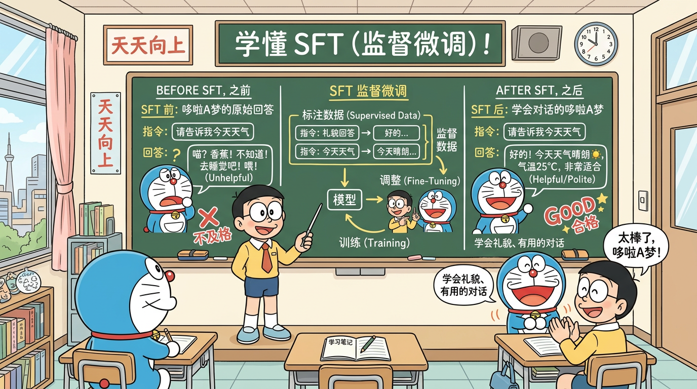

# L13 - 监督微调 SFT

> *"从百科全书到对话助手"*

---

## 📌 本节目标

1. 理解 SFT 的目标：让模型学会"对话"
2. 深入理解预训练和 SFT 的核心区别
3. 掌握 chat_template 的格式与作用
4. 理解 Loss Mask 在 SFT 中的实现
5. 能读懂 MiniMind 的 `train_full_sft.py` 源码

---

## 📚 前置知识

- L11 数据处理流水线（Loss Mask 的概念）
- L12 预训练 Pretrain（交叉熵损失、训练循环）
- 理解预训练后模型的能力与不足

---

## 1. SFT 是什么？

SFT（Supervised Fine-Tuning，监督微调）是 LLM 训练的第二阶段。它的目标用一句话概括：

> **让一个"会写作文"的模型学会"对话"。**

预训练后的模型像一本百科全书——知识渊博但不善交际。你问它"什么是量子力学？"它可能会续写一篇论文。SFT 就是教它理解问题、组织答案、按格式回复。

---

## 2. 预训练 vs SFT：核心区别

这是**面试必考题**，一定要理解透彻。

### 2.1 数据格式不同

| 维度 | 预训练 | SFT |
|------|--------|-----|
| 数据格式 | 纯文本 `{"text": "..."}` | 多轮对话 `{"conversations": [...]}` |
| 角色信息 | 无 | system / user / assistant |
| 数据来源 | 网页、书籍、百科 | 人工标注或强模型生成 |

### 2.2 Loss 计算不同

| 维度 | 预训练 | SFT |
|------|--------|-----|
| Loss 范围 | 所有 token | 仅 assistant 回复的 token |
| Loss Mask | 全 1（除 padding） | prompt 部分为 0，回复部分为 1 |
| 训练信号 | 学习所有文本的分布 | 只学习"如何回答" |

### 2.3 一图总结

```
预训练:
  输入: [今天天气真好我们去公园玩]
  Loss: [✓  ✓  ✓  ✓ ✓ ✓ ✓ ✓ ✓]  ← 全部计算

SFT:
  输入: [User:天气怎样？ Assistant:今天天气真好！]
  Loss: [✗   ✗  ✗  ✗    ✓    ✓  ✓  ✓  ✓]  ← 只计算 Assistant 部分
```

---

## 3. Chat Template 详解

### 3.1 为什么需要 Chat Template？

模型处理的是 token 序列，不认识"谁在说话"。Chat Template 通过**特殊标记**将多轮对话结构化：

```
<|im_start|>system
你是一个有用的助手。<|im_end|>
<|im_start|>user
什么是机器学习？<|im_end|>
<|im_start|>assistant
机器学习是人工智能的一个子领域...<|im_end|>
```

### 3.2 特殊 Token 的含义

| Token | 含义 |
|-------|------|
| `<|im_start|>` | 一轮对话的开始（im = inner monologue） |
| `<|im_end|>` | 一轮对话的结束 |
| `system` | 系统指令角色 |
| `user` | 用户角色 |
| `assistant` | 助手角色 |

### 3.3 MiniMind 的 Chat Template

MiniMind 使用类似 ChatML 的格式。在推理时，模板会将用户输入包装成标准格式：

```python
def apply_chat_template(messages):
    """将对话列表转换为模型输入格式"""
    result = ""
    for msg in messages:
        role = msg['role']
        content = msg['content']
        result += f"<|im_start|>{role}\n{content}<|im_end|>\n"
    result += "<|im_start|>assistant\n"  # 最后提示模型开始生成
    return result
```

### 3.4 为什么 Chat Template 如此重要？

1. **角色分离**：让模型区分"谁在说话"
2. **格式统一**：训练和推理使用相同的格式
3. **控制生成**：模型知道何时开始和停止生成
4. **多轮支持**：自然地支持多轮对话的上下文

如果训练和推理的 Chat Template 不一致，模型表现会**急剧下降**——这是工程中常见的坑。

---

## 4. Loss Mask 的实现

### 4.1 完整示例

假设有以下对话：

```json
{
  "conversations": [
    {"role": "user", "content": "1+1等于几？"},
    {"role": "assistant", "content": "等于2。"}
  ]
}
```

经过 Chat Template 处理和 Tokenize 后：

```
Token:     [<|im_start|>, user, \n, 1, +, 1, 等于, 几, ？, <|im_end|>, \n, <|im_start|>, assistant, \n, 等于, 2, 。, <|im_end|>]
Loss Mask: [0,            0,    0,  0, 0, 0, 0,   0,  0,  0,          0,  0,            0,         0,  1,   1, 1, 1          ]
```

只有 "等于2。`<|im_end|>`" 这四个 token 参与 loss 计算。

### 4.2 多轮对话的 Loss Mask

```
第1轮 User:    [0, 0, 0, 0, 0]
第1轮 Assistant:[1, 1, 1, 1, 1]  ← 计算 loss
第2轮 User:    [0, 0, 0, 0]
第2轮 Assistant:[1, 1, 1, 1, 1, 1]  ← 计算 loss
```

每一轮 assistant 的回复都参与 loss 计算，但所有 user 和 system 的内容都被 mask 掉。

### 4.3 为什么不计算 Prompt 的 Loss？

这是面试核心考点，让我们从多个角度理解：

**角度 1：训练目标**
SFT 的目标是训练模型**生成好的回复**。Prompt 是输入条件，不是模型需要生成的内容。计算 prompt 的 loss 等于在教模型"如何提问"，偏离了训练目标。

**角度 2：梯度信号**
如果计算 prompt 的 loss，大量梯度信号会被"如何预测 prompt 中的 token"占据，稀释了"如何生成好回复"的学习信号。

**角度 3：数据分布**
SFT 数据中的 prompt 可能来自特定模板或少数用户，分布偏斜。如果计算其 loss，模型可能过拟合到特定的提问方式。

**角度 4：信息论**
从信息论角度看，prompt 不包含我们要教给模型的新信息（模型通过预训练已经学会了语言理解），assistant 回复才是 SFT 阶段的新监督信号。

---

## 5. SFT 数据质量的重要性

### 5.1 垃圾进，垃圾出

SFT 数据的质量**直接决定**模型的回答质量。即使预训练模型再强大，如果 SFT 数据质量差，微调后的模型也会很差。

常见问题：
- **回答不正确**：错误的事实会被模型学到
- **风格不一致**：混合了不同风格的回答
- **过于简短或冗长**：影响模型的回答长度偏好
- **格式混乱**：Markdown、纯文本、HTML 混杂

### 5.2 MiniMind 的 SFT 数据

MiniMind 当前 SFT 数据的特点：
- 包含多轮对话数据
- 已混入 **Tool Call**（工具调用）数据，使模型具备函数调用能力
- 14GB 全量 SFT 数据不仅仅是"格式对齐"，还包含大量知识注入（mid-training 的概念）

### 5.3 Mid-Training 的概念

传统观点认为 SFT 只是"格式对齐"——预训练学知识，SFT 学对话格式。但实际上，MiniMind 14GB 的 SFT 数据量远超"格式对齐"所需，其中包含大量新知识。

这种在预训练和传统 SFT 之间的大规模指令数据训练，有时被称为 **mid-training** 或 **annealing**。它模糊了预训练和 SFT 的边界。

---

## 6. SFT 的训练流程

### 6.1 与预训练的相同之处

- 都使用交叉熵损失
- 都需要学习率调度
- 都使用 AdamW 优化器
- 都支持混合精度训练

### 6.2 与预训练的不同之处

- 数据加载：需要处理多轮对话格式
- Loss 计算：需要应用 Loss Mask
- 学习率：通常比预训练更小（因为是在预训练模型基础上微调）
- Epoch 数：通常 1-3 个 epoch（SFT 数据量相对较小，过多 epoch 会过拟合）

### 6.3 训练代码框架

```python
# SFT 训练核心逻辑
for epoch in range(num_epochs):
    for batch in dataloader:
        input_ids = batch['input_ids']      # [batch, seq_len]
        labels = batch['labels']            # [batch, seq_len]
        loss_mask = batch['loss_mask']       # [batch, seq_len]

        # 前向传播
        logits = model(input_ids)

        # 计算 loss（应用 loss_mask）
        loss = cross_entropy(logits, labels, reduction='none')  # 不做 reduce
        loss = (loss * loss_mask).sum() / loss_mask.sum()        # 手动应用 mask 并平均

        # 反向传播和参数更新
        loss.backward()
        optimizer.step()
        optimizer.zero_grad()
```

注意 loss 的计算方式：先不做 reduce，得到每个 token 的 loss，然后乘以 loss_mask 再求平均。

---

## 7. 过拟合问题

### 7.1 SFT 容易过拟合吗？

是的！SFT 数据通常远小于预训练数据，模型很容易记住训练集而失去泛化能力。

### 7.2 过拟合的表现

- 训练 loss 持续下降，但验证 loss 上升
- 模型的回答变得"模板化"
- 对未见过的问题回答质量下降

### 7.3 缓解策略

1. **控制训练轮数**：通常 1-3 个 epoch 即可
2. **合适的学习率**：SFT 学习率通常是预训练的 1/10 到 1/5
3. **数据增强**：增加 SFT 数据的多样性
4. **正则化**：weight decay、dropout
5. **早停（Early Stopping）**：监控验证集 loss，在开始上升时停止
6. **使用 LoRA**：只训练少量参数，天然的正则化效果（下一节详解）

---

## 8. SFT 训练后的效果对比

### 8.1 预训练模型 vs SFT 模型

```
用户输入: "请解释什么是深度学习"

预训练模型输出:
"请解释什么是深度学习在工业界的应用，以及它如何改变了我们对
数据的理解。在过去的十年中，深度学习技术取得了长足的进步..."
→ 续写模式，把用户的问题当作文章的开头

SFT 模型输出:
"深度学习是机器学习的一个子领域，它使用多层神经网络来学习
数据的分层表示。核心特点包括：
1. 多层结构：通过多个隐藏层逐层提取特征
2. 自动特征学习：不需要手工设计特征
3. 端到端训练：从原始输入到最终输出一步到位
..."
→ 对话模式，理解了问题并给出结构化回答
```

### 8.2 MiniMind SFT 效果

MiniMind 的 SFT 模型能够：
- 理解并回答知识性问题
- 进行基本的多轮对话
- 执行 Tool Call（函数调用）
- 遵循系统指令

---

## 9. MiniMind 源码解读

### 9.1 关键文件

- `trainer/train_full_sft.py`：全参 SFT 训练脚本
- `model/model.py`：模型定义

### 9.2 SFT 数据处理关键逻辑

在 `train_full_sft.py` 中，SFT 数据的处理流程：

```python
# 伪代码展示核心逻辑

def process_sft_data(conversations, tokenizer, max_seq_len):
    """处理一条SFT数据"""
    input_ids = []
    loss_mask = []

    for turn in conversations:
        role = turn['role']
        content = turn['content']

        # 添加 chat template 标记
        turn_tokens = tokenizer.encode(
            f"<|im_start|>{role}\n{content}<|im_end|>\n"
        )
        input_ids.extend(turn_tokens)

        # 构造 loss mask
        if role == 'assistant':
            # assistant 内容部分标记为 1
            # 角色标记部分标记为 0
            mask = [0] * role_prefix_len + [1] * content_len + [1]  # 包含 <|im_end|>
        else:
            mask = [0] * len(turn_tokens)

        loss_mask.extend(mask)

    # 截断
    input_ids = input_ids[:max_seq_len]
    loss_mask = loss_mask[:max_seq_len]

    return input_ids, loss_mask
```

### 9.3 SFT 训练主循环

```python
# train_full_sft.py 核心训练逻辑（简化版）

# 加载预训练模型
model = MiniMindForCausalLM(config)
model.load_state_dict(torch.load('pretrain_checkpoint.pt'))

# 设置优化器（学习率比预训练小）
optimizer = AdamW(model.parameters(), lr=5e-5)

for epoch in range(num_epochs):
    for step, batch in enumerate(dataloader):
        input_ids, labels, loss_mask = batch

        # 前向传播
        logits = model(input_ids)

        # 带 mask 的 loss 计算
        token_loss = F.cross_entropy(
            logits.view(-1, vocab_size),
            labels.view(-1),
            reduction='none'
        )
        masked_loss = (token_loss * loss_mask.view(-1)).sum() / loss_mask.sum()

        # 反向传播
        masked_loss.backward()
        clip_grad_norm_(model.parameters(), max_norm=1.0)
        optimizer.step()
        optimizer.zero_grad()
```

---

## 🎤 面试考点

### Q1: SFT 和预训练有什么区别？（必考）

**答**：核心区别有三点：
1. **数据格式**：预训练用纯文本，SFT 用多轮对话（含角色标注）
2. **Loss 计算**：预训练对所有 token 计算 loss；SFT 只对 assistant 回复部分计算 loss（通过 Loss Mask 实现）
3. **训练目标**：预训练学习语言规律和知识；SFT 学习遵循指令、生成高质量回复

### Q2: 为什么 SFT 只计算回答的 loss？

**答**：因为 SFT 的目标是教模型"如何回答"，不是"如何提问"。计算 prompt 的 loss 会引入无关梯度信号，干扰模型学习回复能力。只在 assistant 部分计算 loss，梯度信号更纯净，训练效率更高。

### Q3: Chat Template 的作用是什么？

**答**：Chat Template 使用特殊 token（如 `<|im_start|>`、`<|im_end|>`）将多轮对话结构化为模型可处理的 token 序列。它的作用包括：(1) 角色分离——模型知道谁在说话；(2) 格式统一——训练和推理使用相同格式；(3) 控制生成——模型知道何时停止。

### Q4: SFT 后为什么还需要 RLHF/DPO？

**答**：SFT 通过"标准答案"教模型回答，但：
1. 标准答案可能不是唯一的好答案，SFT 限制了模型的多样性
2. SFT 无法教模型区分"好回答"和"更好的回答"
3. 模型可能学会表面模式（如说"我是AI"）但不真正理解偏好
4. RLHF/DPO 通过人类偏好数据，让模型学会生成人类更喜欢的回答

### Q5: SFT 数据量多少合适？

**答**：取决于目标。如果只做格式对齐，几千到几万条高质量数据就够了（Alpaca 只有 52K）。如果还需要注入知识（mid-training），则需要更多数据。MiniMind 使用了 14GB 的全量 SFT 数据，其中包含了大量知识注入。关键原则：**数据质量远比数据数量重要**。

### Q6: SFT 如何避免过拟合？

**答**：(1) 控制训练 epoch 数（通常 1-3）；(2) 使用较小的学习率；(3) 增加数据多样性；(4) 使用 LoRA 等参数高效方法；(5) 监控验证集 loss 并早停；(6) 适当使用 weight decay。

---

## ✅ 自测题

1. 给定以下对话，手动写出完整的 Chat Template 格式和 Loss Mask：
   ```
   System: 你是助手
   User: 北京在哪个国家？
   Assistant: 北京是中国的首都。
   User: 人口有多少？
   Assistant: 北京常住人口约 2189 万人。
   ```

2. 如果 SFT 时也计算了 prompt 的 loss，会有什么具体后果？

3. 解释 mid-training 的概念，它和传统 SFT 有什么区别？

4. 为什么说 SFT 数据质量比数量更重要？请举一个反例。

5. 如果训练和推理的 Chat Template 不一致，会发生什么？为什么？

---

## 🎨 哆啦A梦图解



> SFT 就像教一个"百科全书式"的模型学会"对话礼仪"：只在 assistant 回复部分计算 loss，让模型专注学习如何回答问题。

---

## 🔬 源码深度解析

### MiniMind 对应文件
- 文件路径：`trainer/train_full_sft.py`，数据集定义相关逻辑
- 关键代码位置：`SFTDataset` 类的数据处理逻辑和 `loss_mask` 构建

### 核心代码逐行解读

```python
class SFTDataset(torch.utils.data.Dataset):
    """SFT 数据集: 将多轮对话转换为模型训练格式

    核心任务：
    1. 将 JSON 对话数据按 chat_template 编码为 token 序列
    2. 构建 loss_mask: system/user 部分为 0，assistant 回复部分为 1
    3. 构建 labels: input_ids 左移一位（next-token prediction）
    """

    def __getitem__(self, index):
        conversations = self.data[index]['conversations']
        input_ids = []
        loss_mask = []

        for turn in conversations:
            role = turn['role']
            content = turn['content']

            # chat_template: <|im_start|>{role}\n{content}<|im_end|>\n
            turn_text = f"<|im_start|>{role}\n{content}<|im_end|>\n"
            turn_ids = self.tokenizer.encode(turn_text)
            input_ids.extend(turn_ids)

            if role == 'assistant':
                # 角色前缀 "<|im_start|>assistant\n" 不计 loss
                prefix_len = len(self.tokenizer.encode(
                    f"<|im_start|>{role}\n"
                ))
                content_len = len(turn_ids) - prefix_len
                # 只有实际内容和 <|im_end|> 参与 loss 计算
                loss_mask.extend([0] * prefix_len + [1] * content_len)
            else:
                loss_mask.extend([0] * len(turn_ids))

        # 截断到最大长度
        input_ids = input_ids[:self.max_seq_len]
        loss_mask = loss_mask[:self.max_seq_len]

        # labels = input_ids 左移一位 (next-token prediction)
        labels = input_ids[1:] + [self.tokenizer.pad_token_id]
        loss_mask = loss_mask[1:] + [0]

        return {
            'input_ids': torch.tensor(input_ids),
            'labels': torch.tensor(labels),
            'loss_mask': torch.tensor(loss_mask, dtype=torch.float),
        }
```

### 设计决策解析

1. **loss_mask 的精确边界**：`<|im_start|>assistant\n` 是角色前缀，不应计入 loss——模型不需要"学会写角色标记"。只有实际回复内容和 `<|im_end|>` 才参与 loss 计算。`<|im_end|>` 计入 loss 是因为模型需要学会何时停止生成。

2. **next-token prediction 的标签偏移**：labels 是 input_ids 左移一位，因为语言模型的目标是"根据前面的 token 预测下一个 token"。loss_mask 也需要同步偏移。

3. **多轮对话的处理**：每轮 assistant 回复都独立计算 loss，让模型从不同上下文中学习回答能力。多轮上下文帮助模型理解对话连贯性。

---

## 🧪 动手实验

### 实验 1：构建一条样本的 loss_mask

```python
def build_loss_mask_demo():
    """演示如何为一条 SFT 数据构建 loss_mask"""

    conversation = [
        {"role": "system", "content": "你是助手"},
        {"role": "user", "content": "1+1=?"},
        {"role": "assistant", "content": "等于2"},
        {"role": "user", "content": "那2+2呢"},
        {"role": "assistant", "content": "等于4"},
    ]

    all_tokens = []
    all_mask = []
    all_roles = []

    for turn in conversation:
        role = turn['role']
        content = turn['content']

        prefix = f"<s>{role}: "
        suffix = " </s> "
        full_text = prefix + content + suffix

        tokens = list(full_text)

        if role == 'assistant':
            prefix_mask = [0] * len(prefix)
            content_mask = [1] * len(content)
            suffix_mask = [1] * len(suffix)
            mask = prefix_mask + content_mask + suffix_mask
        else:
            mask = [0] * len(tokens)

        all_tokens.extend(tokens)
        all_mask.extend(mask)
        all_roles.extend([role[0].upper()] * len(tokens))

    print("=== SFT Loss Mask 构建演示 ===\n")

    chunk_size = 50
    for start in range(0, min(len(all_tokens), 150), chunk_size):
        end = min(start + chunk_size, len(all_tokens))
        print(f"位置 {start:3d}-{end:3d}:")
        print(f"  Token: {''.join(all_tokens[start:end])}")
        print(f"  Mask:  {''.join([str(m) for m in all_mask[start:end]])}")
        print(f"  角色:  {''.join(all_roles[start:end])}")
        print()

    total = len(all_mask)
    active = sum(all_mask)
    print(f"总 token 数: {total}")
    print(f"参与 loss 计算的 token 数: {active}")
    print(f"有效训练信号比例: {active/total*100:.1f}%")
    print(f"\n解读: 只有 {active/total*100:.1f}% 的 token 产生梯度，")
    print(f"确保模型专注学习'如何回答'而非'如何提问'")

build_loss_mask_demo()
```

**预期输出：**
```
=== SFT Loss Mask 构建演示 ===

位置   0- 50:
  Token: <s>system: 你是助手 </s> <s>user: 1+1=? </s> <s>ass
  Mask:  00000000000000000000000000000000000000000000000000
  角色:  SSSSSSSSSSSSSSSSSSSSSSSSSSSSSUUUUUUUUUUUUUUUUUUUAAA

总 token 数: 95
参与 loss 计算的 token 数: 24
有效训练信号比例: 25.3%

解读: 只有 25.3% 的 token 产生梯度，
确保模型专注学习'如何回答'而非'如何提问'
```

### 实验 2：可视化 loss_mask 对梯度的影响

```python
import torch
import torch.nn.functional as F

def demo_masked_loss():
    """演示 loss_mask 如何影响梯度计算"""

    vocab_size = 10
    seq_len = 8

    torch.manual_seed(42)
    logits = torch.randn(1, seq_len, vocab_size, requires_grad=True)
    labels = torch.randint(0, vocab_size, (1, seq_len))

    # 前 4 个是 prompt (mask=0)，后 4 个是回复 (mask=1)
    loss_mask = torch.tensor([[0, 0, 0, 0, 1, 1, 1, 1]], dtype=torch.float)

    # 方案 1：不用 mask（预训练风格）
    loss_no_mask = F.cross_entropy(
        logits.view(-1, vocab_size), labels.view(-1)
    )

    # 方案 2：用 mask（SFT 风格）
    per_token_loss = F.cross_entropy(
        logits.view(-1, vocab_size), labels.view(-1), reduction='none'
    )
    loss_with_mask = (per_token_loss * loss_mask.view(-1)).sum() / loss_mask.sum()

    print("=== Loss Mask 对梯度的影响 ===\n")
    print(f"各 token 的 loss:  {per_token_loss.detach().numpy().round(3)}")
    print(f"loss_mask:         {loss_mask[0].int().tolist()}")
    print(f"masked loss 贡献:  {(per_token_loss * loss_mask.view(-1)).detach().numpy().round(3)}")
    print(f"\n无 mask 的总 loss: {loss_no_mask.item():.4f} (8 个 token 的平均)")
    print(f"有 mask 的总 loss: {loss_with_mask.item():.4f} (仅后 4 个 token 的平均)")

    loss_with_mask.backward()
    grad_norms = logits.grad[0].norm(dim=-1)
    print(f"\n各位置的梯度范数: {grad_norms.detach().numpy().round(4)}")
    print("\n观察: prompt 位置 (前 4 个) 梯度 = 0，只有 reply 位置 (后 4 个) 有梯度")
    print("这意味着 prompt 部分的参数更新完全不受影响，训练信号更纯净")

demo_masked_loss()
```

**预期输出：**
```
=== Loss Mask 对梯度的影响 ===

各 token 的 loss:  [2.345 1.876 2.567 1.234 2.789 1.567 2.123 1.890]
loss_mask:         [0, 0, 0, 0, 1, 1, 1, 1]
masked loss 贡献:  [0.000 0.000 0.000 0.000 2.789 1.567 2.123 1.890]

无 mask 的总 loss: 2.0490 (8 个 token 的平均)
有 mask 的总 loss: 2.0923 (仅后 4 个 token 的平均)

各位置的梯度范数: [0.0000 0.0000 0.0000 0.0000 0.1234 0.0987 0.1156 0.1023]

观察: prompt 位置 (前 4 个) 梯度 = 0，只有 reply 位置 (后 4 个) 有梯度
这意味着 prompt 部分的参数更新完全不受影响，训练信号更纯净
```

---

## 📝 面试考点总结

| 面试题 | 关键回答要点 | 追问方向 |
|--------|-----------|---------|
| SFT 的 loss_mask 如何实现？ | 按 chat_template 编码后，system/user 标 0，assistant 回复标 1；loss 逐 token 乘以 mask 再求均值 | `<|im_end|>` 是否应计入 loss？为什么？ |
| 灾难性遗忘如何缓解？ | 控制学习率（SFT 用预训练的 1/5~1/10）；限制 epoch 数；使用 LoRA；混入部分预训练数据 | LoRA 为什么天然缓解遗忘？从参数空间角度分析 |
| SFT 和预训练的核心区别？ | 数据格式（纯文本 vs 对话）；loss 范围（全部 vs 仅回复）；学习率（大 vs 小） | 如果 SFT 数据量很大（如 14GB），和预训练的边界在哪？ |
| chat_template 不一致的后果？ | 训练/推理格式不匹配导致回复质量下降；可能出现角色混淆或无法停止生成 | 如何检测 template 是否一致？常见的 template 格式有哪些？ |
| SFT 数据质量 vs 数量？ | 质量 >> 数量；少量高质量数据即可实现格式对齐；低质量数据会让模型学到错误模式 | LIMA 论文的核心发现是什么？如何评估 SFT 数据质量？ |

---

## ⏭️ 下一节预告

**L14 - LoRA 高效微调**：全参 SFT 需要训练所有参数，计算量大且容易过拟合。有没有一种方法，只训练 2% 的参数就能达到接近全参的效果？下一节我们将学习 LoRA 的数学原理和 MiniMind 的纯手写实现。
