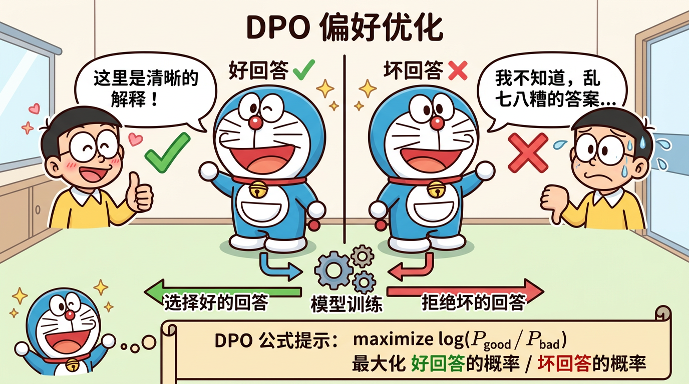

# L17 - DPO 偏好优化

> **"教模型分辨好与坏"**

---

## 本节目标

1. 理解 RLHF 的大背景：SFT 之后为什么还需要"对齐"
2. 掌握 DPO 的核心思想与损失函数的完整推导
3. 理解 DPO 数据格式（chosen / rejected）
4. 对比 DPO 与 PPO 的优劣
5. 阅读 MiniMind 的 `train_dpo.py` 源码

---

## 前置知识

- L09 SFT 微调的基本流程
- 交叉熵损失函数
- 基本的概率论知识（条件概率、似然函数）
- 了解什么是"模型对齐"（Alignment）

---

## 一、为什么 SFT 之后还需要对齐？

### 1.1 SFT 的局限

经过预训练和 SFT 之后，模型已经能够按照指令格式输出回答。但 SFT 本质上是**模仿学习**——它让模型学会"像训练数据那样说话"，但无法让模型理解"什么是好的回答"。

举个例子：

```
用户: 如何减肥？

回答A（有害）: 不吃饭就行了，一周瘦10斤。
回答B（有益）: 建议通过合理饮食和适量运动来减重，每周减0.5-1kg比较健康。
```

SFT 模型可能同时在训练数据中见过这两种风格的回答，它并不"知道"应该优先输出哪一种。

### 1.2 对齐（Alignment）的目标

对齐要解决的核心问题是：**让模型的输出符合人类的偏好和价值观**。

三个关键维度：
- **有帮助（Helpful）**：回答切题、信息丰富
- **诚实（Honest）**：不编造事实、承认不确定性
- **无害（Harmless）**：不输出有害、歧视性内容

### 1.3 RLHF 的经典流程

OpenAI 在 InstructGPT 论文中提出了经典的三步 RLHF：

```
Step 1: SFT        → 让模型学会指令跟随
Step 2: 训练 RM    → 训练一个奖励模型来评分回答质量
Step 3: PPO 训练   → 用 RL 优化模型，让高奖励的回答概率更高
```

但这个流程有个巨大问题：**太复杂了**。需要同时维护 4 个模型（SFT 模型、RM 模型、PPO 策略模型、PPO 价值模型），训练不稳定，超参数难调。

---

## 二、DPO：直接偏好优化

### 2.1 核心思想

DPO（Direct Preference Optimization）的核心洞见是：

> **不需要显式训练奖励模型，可以直接从偏好数据中学习策略。**

DPO 论文证明了一个数学等价关系：在 RLHF 框架下，最优策略可以用一个**封闭形式的解**表达出来，这个解只依赖于偏好数据和参考模型，不需要中间的奖励模型。

### 2.2 DPO 的数据格式

DPO 需要**偏好对**（preference pairs）数据：

```json
{
  "prompt": "如何学好编程？",
  "chosen": "学好编程需要多练习，建议从Python入门...",
  "rejected": "编程很难学，你还是放弃吧"
}
```

每条数据包含：
- `prompt`：用户输入
- `chosen`（\( y_w \)）：人类偏好的"好回答"（winner）
- `rejected`（\( y_l \)）：人类不偏好的"坏回答"（loser）

MiniMind 使用的偏好数据文件是 `dpo.jsonl`。

### 2.3 DPO 背后的数学

#### Bradley-Terry 模型

DPO 基于 Bradley-Terry 偏好模型。给定两个回答 \( y_1 \) 和 \( y_2 \)，人类偏好 \( y_1 \) 的概率为：

\[
P(y_1 \succ y_2 | x) = \sigma(r(x, y_1) - r(x, y_2))
\]

其中 \( \sigma \) 是 sigmoid 函数，\( r(x, y) \) 是隐含的奖励函数。

#### 从 RLHF 到 DPO 的推导

在标准 RLHF 中，我们要最大化：

\[
\max_{\pi_\theta} \mathbb{E}_{x \sim D, y \sim \pi_\theta(\cdot|x)}[r(x,y)] - \beta \cdot D_{KL}[\pi_\theta(\cdot|x) \| \pi_{ref}(\cdot|x)]
\]

这个优化问题有封闭解：

\[
\pi^*(y|x) = \frac{1}{Z(x)} \pi_{ref}(y|x) \exp\left(\frac{r(x,y)}{\beta}\right)
\]

反解出奖励函数：

\[
r(x,y) = \beta \log \frac{\pi^*(y|x)}{\pi_{ref}(y|x)} + \beta \log Z(x)
\]

代入 Bradley-Terry 模型（\( Z(x) \) 恰好被消掉），得到：

\[
P(y_w \succ y_l | x) = \sigma\left(\beta \left[\log \frac{\pi_\theta(y_w|x)}{\pi_{ref}(y_w|x)} - \log \frac{\pi_\theta(y_l|x)}{\pi_{ref}(y_l|x)}\right]\right)
\]

### 2.4 DPO 损失函数

最终的 DPO 损失函数就是对上述偏好概率取负对数似然：

\[
\mathcal{L}_{DPO}(\pi_\theta; \pi_{ref}) = -\mathbb{E}_{(x, y_w, y_l) \sim D}\left[\log \sigma\left(\beta \left[\log \frac{\pi_\theta(y_w|x)}{\pi_{ref}(y_w|x)} - \log \frac{\pi_\theta(y_l|x)}{\pi_{ref}(y_l|x)}\right]\right)\right]
\]

**逐个符号解释：**

| 符号 | 含义 |
|------|------|
| \( \pi_\theta \) | 当前正在训练的策略模型 |
| \( \pi_{ref} \) | 参考模型（通常是 SFT 后的模型，冻结参数） |
| \( y_w \) | chosen 回答（winner） |
| \( y_l \) | rejected 回答（loser） |
| \( x \) | 输入 prompt |
| \( \beta \) | 温度参数，控制偏离参考模型的程度 |
| \( \sigma \) | sigmoid 函数 \( \sigma(z) = \frac{1}{1+e^{-z}} \) |
| \( D \) | 偏好数据集 |

**直觉理解：**

定义隐含奖励差：

\[
\Delta = \beta \left[\log \frac{\pi_\theta(y_w|x)}{\pi_{ref}(y_w|x)} - \log \frac{\pi_\theta(y_l|x)}{\pi_{ref}(y_l|x)}\right]
\]

- 当 \( \Delta \) 越大 → \( \sigma(\Delta) \) 越接近 1 → loss 越小
- 含义：模型相比参考模型，**更大幅度地提升了 chosen 的概率，降低了 rejected 的概率**

### 2.5 β 参数的作用

\( \beta \) 是 DPO 中最关键的超参数：

- **\( \beta \) 越大**：模型越不敢偏离参考模型，输出更保守
- **\( \beta \) 越小**：模型更自由地调整概率分布，可能过拟合偏好数据

典型值范围：0.1 ~ 0.5，MiniMind 默认使用 0.1。

可以这样理解：\( \beta \) 就像一根"弹簧"，把策略模型拉向参考模型。弹簧越硬（\( \beta \) 越大），策略模型越不容易跑远。

### 2.6 参考模型 π_ref 的角色

参考模型在 DPO 中扮演"锚"的角色：

1. **防止模型退化**：没有参考模型约束，模型可能为了最大化偏好差异而输出怪异文本
2. **保持语言能力**：确保模型不会在对齐过程中"忘记"基本的语言生成能力
3. **实践中**：参考模型就是 SFT 之后的模型，在 DPO 训练过程中冻结参数

---

## 三、DPO vs PPO 对比

| 维度 | DPO | PPO |
|------|-----|-----|
| 是否需要 RM | ❌ 不需要 | ✅ 需要 |
| 训练复杂度 | 低（只需 2 个模型） | 高（需要 4 个模型） |
| 数据类型 | Off-Policy（离线偏好对） | On-Policy（在线采样） |
| 训练稳定性 | 较稳定 | 不稳定，超参数敏感 |
| 探索能力 | ❌ 不做在线探索 | ✅ 可以探索新策略 |
| 适用场景 | 偏好对齐、安全性约束 | 能力提升、复杂推理 |
| 计算开销 | 较低 | 较高 |

### Off-Policy vs On-Policy

这是理解 DPO 和 PPO 区别的关键：

- **Off-Policy（DPO）**：使用预先收集好的偏好数据训练，训练过程中不需要模型生成新回答
- **On-Policy（PPO）**：每一步训练都需要当前模型生成回答，再由奖励模型打分

Off-Policy 的优点是简单高效；缺点是如果偏好数据和当前模型的分布差异太大，学习效果会下降。

---

## 四、MiniMind 的 DPO 实现

### 4.1 数据准备

MiniMind 的偏好数据存储在 `dataset/dpo.jsonl` 中，每行一条 JSON：

```json
{
  "prompt": "请解释什么是机器学习",
  "chosen": "机器学习是人工智能的一个分支...",
  "rejected": "机器学习就是让机器学习。"
}
```

### 4.2 核心训练逻辑

`train_dpo.py` 的核心流程如下：

```python
# 1. 加载 SFT 模型作为策略模型和参考模型
policy_model = MiniMindLM.from_pretrained(sft_checkpoint)
ref_model = MiniMindLM.from_pretrained(sft_checkpoint)
ref_model.eval()  # 参考模型冻结参数

# 2. 对每个 batch 的偏好对
for batch in dataloader:
    prompt, chosen, rejected = batch

    # 3. 计算策略模型和参考模型的 log 概率
    policy_chosen_logps = get_log_probs(policy_model, prompt, chosen)
    policy_rejected_logps = get_log_probs(policy_model, prompt, rejected)
    ref_chosen_logps = get_log_probs(ref_model, prompt, chosen)
    ref_rejected_logps = get_log_probs(ref_model, prompt, rejected)

    # 4. 计算 DPO 损失
    chosen_rewards = beta * (policy_chosen_logps - ref_chosen_logps)
    rejected_rewards = beta * (policy_rejected_logps - ref_rejected_logps)
    loss = -F.logsigmoid(chosen_rewards - rejected_rewards).mean()

    # 5. 反向传播，只更新策略模型
    loss.backward()
    optimizer.step()
```

### 4.3 关键实现细节

**log 概率的计算**：

```python
def get_log_probs(model, input_ids, labels):
    logits = model(input_ids).logits
    log_probs = F.log_softmax(logits, dim=-1)
    # 取出每个 token 对应 label 位置的 log 概率
    per_token_logps = torch.gather(log_probs, 2, labels.unsqueeze(2)).squeeze(2)
    # 对 sequence 维度求和（联合概率 = 各 token 概率的乘积 → log 空间就是求和）
    return per_token_logps.sum(dim=-1)
```

这里的关键：\( \log \pi_\theta(y|x) = \sum_{t=1}^{T} \log \pi_\theta(y_t | x, y_{<t}) \)，即序列的 log 概率等于各个 token 的条件 log 概率之和。

---

## 五、DPO 的局限性

### 5.1 不做在线探索

DPO 是 Off-Policy 方法，它只学习已有偏好数据中的好坏对比，不会主动尝试新的回答方式。如果偏好数据覆盖不全面，模型的改进有限。

### 5.2 更适合"对齐"而非"能力提升"

DPO 擅长教模型"什么不该说"（安全性对齐），但不太擅长教模型"如何解决复杂问题"（能力提升）。对于推理能力的提升，PPO/GRPO 等在线方法通常更有效。

### 5.3 数据质量要求高

DPO 的效果严重依赖偏好数据的质量。如果 chosen 和 rejected 的区分度不够大，或者存在标注噪声，DPO 的训练效果会大打折扣。

### 5.4 分布偏移问题

当策略模型和参考模型的分布差异越来越大时，DPO 的梯度信号会逐渐减弱，训练趋于停滞。这是 Off-Policy 方法的天然局限。

---

## 🎤 面试考点

### Q1: DPO 的损失函数是什么？请写出来并解释每个符号。

**答**：

\[
\mathcal{L}_{DPO} = -\mathbb{E}_{(x, y_w, y_l)}\left[\log \sigma\left(\beta \left[\log \frac{\pi_\theta(y_w|x)}{\pi_{ref}(y_w|x)} - \log \frac{\pi_\theta(y_l|x)}{\pi_{ref}(y_l|x)}\right]\right)\right]
\]

核心含义是让模型相对于参考模型更多地提升好回答的概率、降低坏回答的概率。β 控制了偏离参考模型的程度。

### Q2: DPO 和 PPO 的主要区别是什么？

**答**：
1. DPO 不需要训练奖励模型，PPO 需要
2. DPO 是 Off-Policy（用固定数据集），PPO 是 On-Policy（需要在线采样）
3. DPO 更简单稳定，PPO 训练更复杂但探索能力更强
4. DPO 更适合偏好对齐，PPO 更适合能力提升

### Q3: β 在 DPO 中的作用是什么？β 太大或太小会怎样？

**答**：β 控制策略模型偏离参考模型的程度。β 越大，模型越保守，越不敢偏离参考模型；β 越小，模型变化越大，可能过拟合偏好数据。实践中常用 0.1~0.5。

### Q4: 为什么 DPO 不需要训练 Reward Model？

**答**：DPO 论文证明，在 RLHF 框架下，最优策略有封闭形式的解。通过这个解可以把奖励函数用策略模型和参考模型的对数概率比来表达，代入 Bradley-Terry 偏好模型后，奖励模型被消掉了，只剩下策略模型和参考模型的概率。

### Q5: DPO 的参考模型 π_ref 是什么？为什么需要它？

**答**：参考模型通常是 SFT 后的模型，在 DPO 训练过程中冻结参数。它的作用是：(1) 防止策略模型输出退化；(2) 保持基本的语言生成能力；(3) 作为 KL 惩罚的"锚点"。

### Q6: DPO 训练中，log 概率是怎么算的？

**答**：序列级别的 log 概率等于每个 token 条件 log 概率之和：\( \log \pi(y|x) = \sum_t \log \pi(y_t|x,y_{<t}) \)。实现时对模型 logits 做 log_softmax，gather 出对应 token 的值，然后 sum。

### Q7: DPO 有什么局限性？

**答**：(1) Off-Policy，不做在线探索，受偏好数据质量限制；(2) 更适合对齐而非能力提升；(3) 存在分布偏移问题，策略模型偏离参考模型太远时梯度减弱；(4) 数据标注质量要求高。

---

## ✅ 自测题

1. **填空**：DPO 的全称是 ____________________。
2. **判断**：DPO 训练过程中需要先训练一个奖励模型。（对/错）
3. **选择**：β=0.5 和 β=0.05 相比，哪个让模型更保守？
   - A. β=0.5
   - B. β=0.05
4. **简答**：为什么说 DPO 是 Off-Policy 的？这对训练有什么影响？
5. **编程**：给定 policy_chosen_logps、policy_rejected_logps、ref_chosen_logps、ref_rejected_logps 和 beta，用 PyTorch 写出 DPO loss 的计算代码。

<details>
<summary>参考答案</summary>

1. Direct Preference Optimization
2. 错。DPO 直接从偏好数据学习，不需要训练奖励模型。
3. A。β 越大越保守。
4. Off-Policy 指的是训练数据是预先收集好的，不需要当前模型在线生成。这使得 DPO 训练简单高效，但也意味着它不能探索数据集之外的回答空间，且当模型更新后与数据分布偏差变大时效果会下降。
5. 代码：
```python
chosen_rewards = beta * (policy_chosen_logps - ref_chosen_logps)
rejected_rewards = beta * (policy_rejected_logps - ref_rejected_logps)
loss = -torch.nn.functional.logsigmoid(chosen_rewards - rejected_rewards).mean()
```

</details>

---

## 🎨 哆啦A梦图解



> DPO 让模型学会区分"好回答"和"坏回答"：相比参考模型，好回答的概率要提升，坏回答的概率要降低，两者的差距越大 loss 越小。

---

## 🔬 源码深度解析

### MiniMind 对应文件
- 文件路径：`trainer/train_dpo.py`
- 关键代码位置：DPO 损失计算逻辑、参考模型的加载与冻结

### 核心代码逐行解读

```python
# DPO 训练核心逻辑

# 1. 加载策略模型和参考模型（参考模型冻结）
policy_model = MiniMindLM.from_pretrained(sft_checkpoint)
ref_model = MiniMindLM.from_pretrained(sft_checkpoint)
for param in ref_model.parameters():
    param.requires_grad = False  # 冻结参考模型


def compute_log_probs(model, input_ids, labels, loss_mask):
    """计算序列的条件 log 概率

    核心公式: log π(y|x) = Σ_t log π(y_t | x, y_{<t})
    """
    logits = model(input_ids).logits                  # (bsz, seq, vocab)
    log_probs = F.log_softmax(logits, dim=-1)         # logits → log 概率
    # gather: 取出每个位置对应 label 的 log 概率
    per_token_logps = torch.gather(
        log_probs, 2, labels.unsqueeze(2)
    ).squeeze(2)                                       # (bsz, seq)
    # 仅在回复部分求和（prompt 部分 mask=0 被过滤）
    return (per_token_logps * loss_mask).sum(dim=-1)   # (bsz,)


def dpo_loss(policy_model, ref_model, batch, beta=0.1):
    """计算 DPO 损失

    L = -E[log σ(β * (Δ_chosen - Δ_rejected))]
    其中 Δ_y = log π_θ(y|x) - log π_ref(y|x)
    """
    with torch.no_grad():
        ref_chosen_logps = compute_log_probs(
            ref_model, batch['chosen_ids'],
            batch['chosen_labels'], batch['chosen_mask']
        )
        ref_rejected_logps = compute_log_probs(
            ref_model, batch['rejected_ids'],
            batch['rejected_labels'], batch['rejected_mask']
        )

    policy_chosen_logps = compute_log_probs(
        policy_model, batch['chosen_ids'],
        batch['chosen_labels'], batch['chosen_mask']
    )
    policy_rejected_logps = compute_log_probs(
        policy_model, batch['rejected_ids'],
        batch['rejected_labels'], batch['rejected_mask']
    )

    # 隐含奖励 = β × 相对于参考模型的 log 概率变化
    chosen_rewards = beta * (policy_chosen_logps - ref_chosen_logps)
    rejected_rewards = beta * (policy_rejected_logps - ref_rejected_logps)

    # DPO loss: 最大化 chosen 与 rejected 的隐含奖励差
    loss = -F.logsigmoid(chosen_rewards - rejected_rewards).mean()

    return loss
```

### 设计决策解析

1. **参考模型冻结**：参考模型（SFT 后的模型）在 DPO 训练中保持参数不变。它充当"锚点"，防止策略模型为了最大化偏好差异而偏离正常的语言生成能力。如果不冻结，两个模型同时更新会导致训练不稳定。

2. **beta = 0.1 的选择**：较小的 β 让模型更自由地调整概率分布，但有过拟合风险；较大的 β 约束模型更保守，可能训练不充分。0.1 是经验上效果较好的默认值，在安全对齐场景中常用。

3. **loss_mask 在 DPO 中的角色**：和 SFT 一样，只在 assistant 回复部分计算 log 概率。prompt 部分 chosen 和 rejected 共享相同的内容，不需要也不应该计入概率差异。

---

## 🧪 动手实验

### 实验 1：手动计算 DPO 损失

```python
import torch
import torch.nn.functional as F

def demo_dpo_loss():
    """手动计算一个简单的 DPO loss 示例"""

    # 模拟策略模型和参考模型的 log 概率
    policy_chosen_logps = torch.tensor([-5.0])
    policy_rejected_logps = torch.tensor([-8.0])
    ref_chosen_logps = torch.tensor([-6.0])
    ref_rejected_logps = torch.tensor([-7.0])

    beta = 0.1

    # 计算隐含奖励
    chosen_reward = beta * (policy_chosen_logps - ref_chosen_logps)
    rejected_reward = beta * (policy_rejected_logps - ref_rejected_logps)

    print("=== DPO Loss 手动计算 ===\n")
    print(f"策略模型 log π_θ(y_w|x) = {policy_chosen_logps.item()}")
    print(f"参考模型 log π_ref(y_w|x) = {ref_chosen_logps.item()}")
    print(f"→ Chosen 隐含奖励 = β × Δ = {beta} × ({policy_chosen_logps.item()} - {ref_chosen_logps.item()}) = {chosen_reward.item():.4f}")

    print(f"\n策略模型 log π_θ(y_l|x) = {policy_rejected_logps.item()}")
    print(f"参考模型 log π_ref(y_l|x) = {ref_rejected_logps.item()}")
    print(f"→ Rejected 隐含奖励 = β × Δ = {beta} × ({policy_rejected_logps.item()} - {ref_rejected_logps.item()}) = {rejected_reward.item():.4f}")

    delta = chosen_reward - rejected_reward
    sigma_delta = torch.sigmoid(delta)
    loss = -F.logsigmoid(delta)

    print(f"\n奖励差 Δ = {delta.item():.4f}")
    print(f"σ(Δ) = {sigma_delta.item():.4f}")
    print(f"DPO Loss = -log σ(Δ) = {loss.item():.4f}")

    print(f"\n解读:")
    print(f"  策略模型提升了 chosen 概率 (Δ_chosen > 0: +1.0)")
    print(f"  策略模型降低了 rejected 概率 (Δ_rejected < 0: -1.0)")
    print(f"  总奖励差 Δ = 0.2 > 0，优化方向正确")
    print(f"  随着训练推进，Δ 会越来越大，loss 越来越小")

demo_dpo_loss()
```

**预期输出：**
```
=== DPO Loss 手动计算 ===

策略模型 log π_θ(y_w|x) = -5.0
参考模型 log π_ref(y_w|x) = -6.0
→ Chosen 隐含奖励 = β × Δ = 0.1 × (-5.0 - -6.0) = 0.1000

策略模型 log π_θ(y_l|x) = -8.0
参考模型 log π_ref(y_l|x) = -7.0
→ Rejected 隐含奖励 = β × Δ = 0.1 × (-8.0 - -7.0) = -0.1000

奖励差 Δ = 0.2000
σ(Δ) = 0.5498
DPO Loss = -log σ(Δ) = 0.5981

解读:
  策略模型提升了 chosen 概率 (Δ_chosen > 0: +1.0)
  策略模型降低了 rejected 概率 (Δ_rejected < 0: -1.0)
  总奖励差 Δ = 0.2 > 0，优化方向正确
  随着训练推进，Δ 会越来越大，loss 越来越小
```

### 实验 2：可视化 β 参数对 DPO Loss 的影响

```python
import torch
import torch.nn.functional as F
import matplotlib.pyplot as plt

def compute_dpo_loss_curve(beta, delta_range=(-10, 10)):
    """计算不同 Δ 值下的 DPO loss"""
    deltas = torch.linspace(delta_range[0], delta_range[1], 200)
    losses = -F.logsigmoid(beta * deltas)
    return deltas.numpy(), losses.numpy()

plt.figure(figsize=(10, 6))

for beta in [0.05, 0.1, 0.2, 0.5]:
    deltas, losses = compute_dpo_loss_curve(beta)
    plt.plot(deltas, losses, label=f'β={beta}', linewidth=2)

plt.xlabel('Δ = log_ratio_chosen - log_ratio_rejected')
plt.ylabel('DPO Loss')
plt.title('不同 β 值对 DPO Loss 曲线的影响')
plt.legend(fontsize=12)
plt.grid(True, alpha=0.3)
plt.axvline(x=0, color='gray', linestyle='--', alpha=0.5)
plt.tight_layout()
plt.show()

print("=== β 参数影响分析 ===")
print("1. β 越大 → 曲线越陡 → 模型越保守 → 更难偏离参考模型")
print("2. β 越小 → 曲线越平 → 模型越自由 → 但可能过拟合偏好数据")
print("3. Δ > 0 时 loss 较小（正确方向），Δ < 0 时 loss 较大（错误方向）")
print("4. 实践中 β ∈ [0.1, 0.5] 是常见范围，MiniMind 默认 β = 0.1")
```

**预期输出：**
```
=== β 参数影响分析 ===
1. β 越大 → 曲线越陡 → 模型越保守 → 更难偏离参考模型
2. β 越小 → 曲线越平 → 模型越自由 → 但可能过拟合偏好数据
3. Δ > 0 时 loss 较小（正确方向），Δ < 0 时 loss 较大（错误方向）
4. 实践中 β ∈ [0.1, 0.5] 是常见范围，MiniMind 默认 β = 0.1
```

---

## 📝 面试考点总结

| 面试题 | 关键回答要点 | 追问方向 |
|--------|-----------|---------|
| DPO 的数学推导？ | 从 RLHF 的 KL 约束优化出发，解出最优策略的封闭形式；反解奖励函数代入 Bradley-Terry 模型，Z(x) 恰好消掉 | 为什么 Z(x) 会消掉？如果偏好模型不是 Bradley-Terry 还能推吗？ |
| DPO vs PPO vs GRPO？ | DPO: 离线偏好对，简单稳定；PPO: 在线采样+RM，复杂但探索性强；GRPO: 无 Critic 的 PPO 简化版 | 什么场景用哪个？推理能力提升该选哪个？ |
| 参考模型的作用？ | 防止模型退化，保持基本语言能力；作为 KL 惩罚的锚点；实践中是冻结的 SFT 模型 | 能否用 EMA 更新参考模型？IPO 如何不依赖参考模型？ |
| β 怎么选？ | 0.1~0.5 常见；β 越大越保守；需要根据偏好数据质量和策略偏移程度调整 | β 可以在训练中动态调整吗？有理论最优值吗？ |
| DPO 的局限性？ | Off-Policy 不做探索；更适合对齐而非能力提升；数据质量要求高；分布偏移导致梯度减弱 | 如何用 online DPO 或 iterative DPO 缓解这些问题？ |

---

## 下一节预告

下一节我们将学习 **PPO 与 GRPO 强化学习**，了解 On-Policy 的强化学习方法如何通过在线探索来提升模型能力，以及 DeepSeek 提出的 GRPO 如何简化 PPO 流程。
